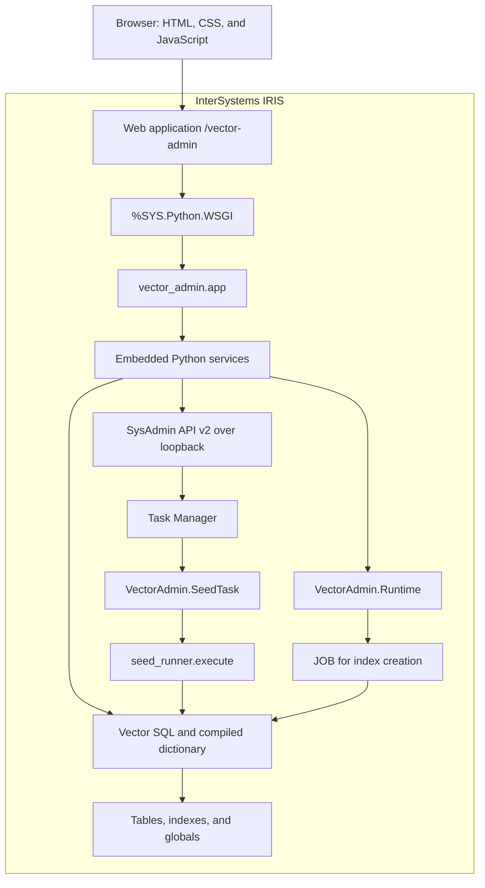
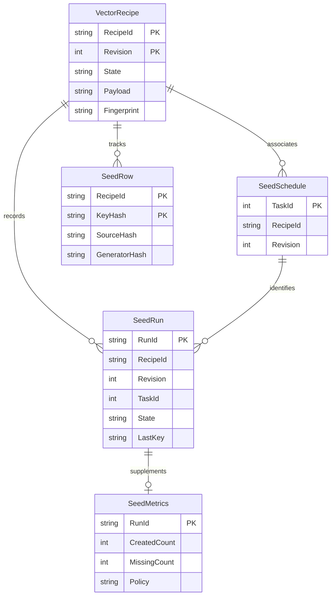
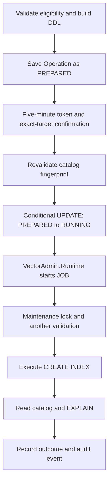
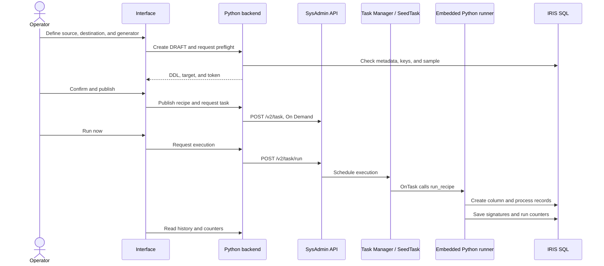
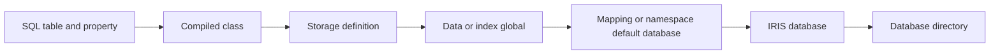

# IRIS Vector Management: developing a vector portal with Embedded Python, SQL, and ObjectScript

## Introduction

**IRIS Vector Management** is a portal hosted by InterSystems IRIS for inspecting and populating vector columns. It discovers `VECTOR` and `EMBEDDING` properties, displays records and bounded vector previews, runs similarity searches, resolves storage placement, validates and creates HNSW indexes, and publishes generation tasks for existing tables.

The implementation uses Embedded Python, vector SQL, the compiled class dictionary, IRIS globals, Task Manager, and SysAdmin API v2. HTML, CSS, and JavaScript provide the interface through `%SYS.Python.WSGI`.

The reference environment is **InterSystems IRIS Community 2026.2, Build 221U**, pinned by digest in the `Dockerfile`. The application checks this build before enabling catalog discovery, vector search, and HNSW maintenance. The validated behavior therefore targets this release.

The sections below trace the implementation from the browser to SQL and scheduled execution. The practical example populates document vectors, changes the source data, and uses the same task to process new and changed documents.

## 1. Architecture: the application runs inside IRIS

The browser opens `/vector-admin/`. The IRIS web application dispatches requests to `%SYS.Python.WSGI`, which loads `wsgi.application` and then `vector_admin/app.py`.

The WSGI process executes SQL and accesses IRIS classes through the `iris` module. A local HTTP client handles SysAdmin API calls with the request operator's credentials. HNSW creation runs in a `JOB`; vector generation runs as an IRIS Task Manager task.



IRIS executes the similarity query and the SQL `EMBEDDING` function. The browser receives data and operational evidence through the portal.

### From the interface to Embedded Python

`iris/install.script` registers `/vector-admin` with `DispatchClass=%SYS.Python.WSGI`, `WSGIAppName=wsgi`, `WSGICallable=application`, and `WSGIAppLocation=/usr/irissys/csp/vector-admin/`. The complete entry point in `wsgi.py` is:

```python
from vector_admin.app import application
```

`vector_admin/static/index.html` defines the navigation, tables, and forms. `app.css` uses Grid for forms and cards, Flexbox for toolbars, and media queries for narrower screens. `app.js` switches views through the `hidden` attribute and updates DOM nodes after each request. The Python editor sets `aria-invalid` and reports validation results through a status element.

The browser's request helper, reformatted from `app.js`, sends JSON to the same origin and includes the CSRF token returned by `/api/capabilities`:

```javascript
async function api(path, body) {
    const response = await fetch(path, {
        credentials: 'same-origin',
        headers: body ? {
            'Content-Type': 'application/json',
            'X-CSRF-Token': state.cap?.csrf || ''
        } : {},
        method: body ? 'POST' : 'GET',
        body: body ? JSON.stringify(body) : undefined
    });
    const data = await response.json();
    if (!response.ok) throw new Error(`${data.code}: ${data.message}`);
    return data;
}
```

For a search, the form sends `{vector: [1, 0, 0], distance: 'Cosine', k: 3}` to `api/vectors/<asset-id>/search`. The identifier comes from the inventory response. The vector route in `app.py` resolves it through the catalog, enters the asset's namespace, and dispatches the request. This excerpt shows the search branch:

```python
asset = catalog.lookup(match[1])
suffix = match[2]
with namespace(asset['namespace']):
    if method == 'POST' and suffix == '/search':
        return search.execute(asset, json_body(environ))
```

The `namespace` context manager restores the previous namespace in `finally`. `search.execute` returns matches, timing, SQL, and plan evidence. The WSGI entry point serializes that dictionary to JSON; the interface renders the result. Application errors return a `code` and `message` with an HTTP status.

### Responsibilities in the code

| File or directory | Responsibility |
| --- | --- |
| `vector_admin/app.py` | WSGI routes, JSON handling, request limits, and error responses. |
| `auth.py`, `settings.py`, `sql.py` | Identity, permissions, tokens, configuration, namespaces, and SQL execution. |
| `catalog.py`, `configs.py` | Vector-property and embedding-configuration discovery. |
| `explorer.py`, `search.py` | Record pagination, vector previews, similarity queries, and plan diagnosis. |
| `placement.py`, `sysadmin_client.py` | Storage resolution and administrative integration. |
| `indexes.py` | HNSW validation, confirmation, and asynchronous DDL execution. |
| `recipes.py`, `generators.py`, `seed_runner.py` | Recipes, Python validation, and repeatable vector population. |
| `tasks.py`, `audit.py` | Task monitoring and application auditing. |
| `vector_admin/static/` | HTML, CSS, and JavaScript interface. |
| `iris/`, `tools/`, `tests/` | ObjectScript classes, installation, fixtures, and checks. |

Modules without a directory in this table belong to `vector_admin/`. The code uses functional modules and explicit SQL; it has no ORM.

## 2. Technologies and libraries

The portal uses the Python standard library and the `iris` module supplied by Embedded Python. `iris.sql.exec` executes SQL, `iris.cls` accesses classes, and `iris.system` returns process and instance information.

| Technology | Use in the project |
| --- | --- |
| `%SYS.Python.WSGI` | Hosts the Python application inside IRIS. |
| `%Dictionary.CompiledClass`, `CompiledProperty`, `CompiledIndex`, `CompiledStorage` | Provides compiled structure, vector parameters, indexes, and storage definitions. |
| `VECTOR`, `EMBEDDING`, `TO_VECTOR`, `VECTOR_COSINE`, `VECTOR_DOT_PRODUCT` | Provides vector persistence, generation, and similarity search through SQL. |
| `%Embedding.Config`, `%Embedding.SentenceTransformers` | Provides model configuration and the demonstration provider. |
| `%SYS.Task.Definition` | Base class for `VectorAdmin.SeedTask`, executed by the IRIS scheduler. |
| ObjectScript `JOB`, `LOCK`, transactions, and `%SYSTEM.Event` | Coordinates workers and controls execution across processes. |
| `json`, `re`, `math`, `hashlib`, `hmac`, `secrets`, `contextvars`, `urllib` | Implements serialization, validation, signatures, request context, and HTTP integration. |
| `ast` and `compile` | Validates Python generator syntax and signatures. |
| HTML, CSS, and JavaScript with `fetch` | Implements the interface and same-origin requests. |
| Docker and Compose | Builds and runs the demonstration environment. |

The demonstration dependencies are separate from the portal requirements. `requirements-seeder.txt` pins **Faker 37.6.0** for Portuguese sample documents. `requirements-fixtures.txt` pins the local model stack, including **SentenceTransformers 5.1.2**, **Transformers 4.57.6**, **PyTorch 2.14.0+cpu**, and their numerical and tokenization dependencies.

`WITH_FIXTURES=0` omits the fixtures and this machine-learning stack. The Dockerfile still installs the seeder requirement. The web application has no Flask, Django, or Node.js build step.

## 3. Data model: vectors, embeddings, and source evidence

### Two representations

The `VectorFixture.Raw` fixture declares an ordinary vector column:

```sql
CREATE TABLE VectorFixture.Raw (
    ID INTEGER IDENTITY,
    Label VARCHAR(80),
    Embedding VECTOR(DOUBLE,3)
)
```

The fixture inserts values with `TO_VECTOR`:

```python
iris.sql.exec(
    'INSERT INTO VectorFixture.Raw (Label,Embedding) '
    'VALUES (?,TO_VECTOR(?,DOUBLE))',
    'Fixture 1',
    '[1,0,0]'
)
```

This schema records type and dimension. It contains no model or source-text binding. The inventory reports source and model as unknown when the metadata cannot prove that relationship.

The managed fixture declares both the configuration and source property:

```sql
CREATE TABLE VectorFixture.Managed (
    ID INTEGER IDENTITY,
    Content VARCHAR(512),
    Embedding EMBEDDING('vector-fixture-tiny','Content')
)
```

The catalog can associate the vector with `Content` and `vector-fixture-tiny`. It reads the provider class, dimension, and allowed public settings from `%Embedding.Config`.

A task created by the portal adds an ordinary `VECTOR(DOUBLE,n)` column, including when it uses a model. The recipe stores the operational relationship with the source and generator. The resulting column remains a regular vector column; the schema does not become a managed `EMBEDDING` property.


### The catalog reads the compiled dictionary

`catalog.discover` queries `%Dictionary.CompiledProperty` with `%Dictionary.CompiledClass`. In the target build, `INFORMATION_SCHEMA` can expose vector types as `varchar`; the compiled dictionary preserves their vector identity.

The recognized types are `%Library.Vector`, `%Embedding.Vector`, and `%Library.Embedding`. The service reads `LEN`, `DATATYPE`, `MODEL`, `SOURCE`, and `CONFIGURATION` through the dictionary object API:

```python
obj = iris.cls('%Dictionary.CompiledProperty')._OpenId(
    class_name + '||' + property_name
)
dimensions = obj.Parameters.GetAt('LEN')
element_type = obj.Parameters.GetAt('DATATYPE')
```

The catalog also resolves the SQL property name, a usable key, the storage definition, and indexes with `TypeClass = %SQL.Index.HNSW`. Each asset receives a metadata fingerprint and an operator-bound signed identifier. Later requests validate that identifier and refresh the catalog data.

## 4. Operational model for recipes and runs

Vector values stay in their destination tables. `tools/install.py` creates the `VectorAdmin` schema for application control data:

| Table | Key | Main contents |
| --- | --- | --- |
| `VectorRecipe` | `RecipeId, Revision` | Name, state, JSON payload, fingerprint, author, and timestamps. |
| `SeedSchedule` | `TaskId` | Association between an IRIS task and a recipe/revision. |
| `SeedRun` | `RunId` | State, counters, last key, heartbeat, and summarized error. |
| `SeedMetrics` | `RunId` | Created vectors, missing destinations, and run policy. |
| `SeedRow` | `RecipeId, KeyHash` | Source and generator signatures and update timestamp. |
| `Operation` | `OperationId` | HNSW proposal, expiration, state, and outcome. |
| `Audit` | `EventId` | Operator, action, target, state, and filtered evidence. |
| `FixtureRegistry` | `Name` | Demonstration tables managed by the seeder. |

The associations used by the application are logical. The installation DDL does not declare foreign keys between these tables.



The current workflow creates recipes at revision 1 and exposes no revision editor. Despite its name, `SeedTask.RecipeRevision` stores the recipe identifier. The executor resolves that identifier to the latest version at run time.

## 5. Record inspection: keyset pagination and bounded previews

`explorer.page` uses keyset pagination. A subsequent page compares the key with the last value returned:

```sql
SELECT TOP 26
    ID,
    CASE WHEN Embedding IS NULL THEN 0 ELSE 1 END
FROM VectorFixture.Raw
WHERE ID > ?
ORDER BY ID
```

The query returns 25 records plus one row to signal another page. The initial request omits full vectors. The view selects source text only when its binding is established and limits it to 1,200 characters.

The **Preview vector** action makes a separate request. The backend uses `%EXTERNAL`, calculates the Euclidean norm as `sqrt(max(0, VECTOR_DOT_PRODUCT(v,v)))`, and returns at most 32 values. It materializes the selected record's vector up to the accepted maximum dimension of 16,384; the 32-value limit applies to the response.

The inventory counters describe the current page. The screen does not execute `COUNT(*)` against data tables.


## 6. Similarity search and SQL plan inspection

`search.build` combines catalog-derived identifiers with parameterized values. A three-dimensional numerical search has this shape:

```sql
SELECT TOP 3
    "ID",
    VECTOR_COSINE("Embedding",TO_VECTOR(?, DOUBLE)) AS Score
FROM "VectorFixture"."Raw"
ORDER BY Score DESC
```

The parameter can be `'[1,0,0]'`. Before execution, the backend validates dimension, numeric type, and finite values. Booleans, `NaN`, and infinity are rejected. `VECTOR_DOT_PRODUCT` is also supported, with descending scores.

For a managed column, the query vector comes from `EMBEDDING`:

```sql
SELECT TOP 3
    "ID",
    VECTOR_COSINE("Embedding",EMBEDDING(?, ?)) AS Score
FROM "VectorFixture"."Managed"
ORDER BY Score DESC
```

The parameters are the text, such as `vector search`, and the configuration identified by the catalog. `EMBEDDING` still requires the IRIS SQL privileges for the operation, including `%USE_EMBEDDING`.

Before running the search, `search.execute` obtains `EXPLAIN`. The diagnosis looks for a `Read index map` line matching an HNSW index found in the catalog and reports `HNSW used`, `Full scan`, or `Undetermined`. `EXPLAIN` describes the access plan; it does not measure recall or provide a complete runtime profile.

Top K is limited to 100. IRIS locks protect two concurrency slots across WSGI processes. The displayed time includes plan retrieval and query execution. The backend's `indexed` mode checks for a compatible index and does not force the optimizer with a SQL hint.


## 7. HNSW: validated proposals and asynchronous execution

`indexes.preflight` checks fixed dimensions, `DOUBLE` or `DECIMAL` elements, `%Storage.Persistent` storage, bitmap-compatible IDs, `ALTER` permission, and the absence of another HNSW index on the column. The enabled profile is `M=24` and `efConstruction=100`.

For an eligible table without an HNSW index, the generated DDL has this form:

```sql
CREATE INDEX "DocumentHNSW"
ON TABLE "VectorFixture"."Unindexed" ("Embedding")
AS HNSW(Distance='Cosine', M=24, efConstruction=100)
```

`DotProduct` requires the operator to declare that the vectors are normalized. Preflight records that assertion; it does not scan the table to verify normalization.



The conditional `UPDATE` must affect exactly one row, so each proposal can be consumed once across processes. After DDL execution, the worker looks for the created definition and records a verification plan. An observation error after DDL issuance can produce `UNKNOWN`. Inspect the catalog to establish the outcome before attempting another operation.


## 8. Recipes: populate a new vector column

A recipe defines the namespace, destination table, new column, relationship column, text source, dimension, generator, and rerun policy. The source SQL follows this restricted format:

```sql
SELECT ID, Description FROM data.Document
```

The first column identifies the destination row. The second supplies the text. The parser accepts two bare columns and one qualified table. It rejects aliases, joins, expressions, filters, and a trailing semicolon. Source and destination can be different tables in the selected namespace when their relationship keys match.

Preflight rejects null or duplicate keys in source and destination, checks that the target column is new, and tests the generator when the first source row has non-null text. It returns the `ALTER TABLE` statement and exact target for confirmation. Publication saves the recipe state and task definition. **Run now** creates and populates the destination column.

`catalog.source_tables` supplies the table selector. It suggests a relationship column named `ID`, or a name ending in `ID`. Preflight checks uniqueness and nulls; the suggestion alone establishes neither property.




### Generation through the IRIS embedding mechanism

In `MODEL` mode, the executor reads the configuration and uses `EMBEDDING` in the `UPDATE`. A 16-dimensional recipe produces DDL with this shape:

```sql
ALTER TABLE "data"."Document"
ADD "DescriptionVector" VECTOR(DOUBLE,16)
```

```sql
UPDATE "data"."Document"
SET "DescriptionVector" = EMBEDDING(?,?)
WHERE "ID" = ?
```

The vector is written to the destination row. A source key without a matching destination increments the missing-target count and leaves the data table unchanged.

`%Embedding.Config` connects the SQL configuration name to a provider class. The fixture registers `%Embedding.SentenceTransformers` with a local model path. `EMBEDDING` invokes that provider, which loads the SentenceTransformers pipeline and its PyTorch model in the IRIS environment.

The model assembly in `tools/fixtures.py` uses these components after saving a tokenizer and a randomly initialized BERT to `base`:

```python
SentenceTransformer(modules=[
    models.Transformer(str(base), max_seq_length=64),
    models.Pooling(16),
    models.Normalize()
]).save(str(model_path))
```

Transformers supplies BERT and its tokenizer; SentenceTransformers applies token encoding, pooling, and normalization to produce a 16-value vector. The fixture uses an eight-token vocabulary and random weights for offline integration tests. Semantic evaluation requires a model trained for the intended documents and language.

**Embedding configs** reads configuration names, provider classes, dimensions, and allowed public settings through `/api/instances/local/embedding-configs`. The screen supports inspection; provider registration is handled outside this interface.


### Generation through a Python function

`PYTHON` mode accepts `generate(row, context)`. This three-dimensional example provides numeric features for workflow testing:

```python
def generate(row, context):
    text = row["text"] or ""
    return [float(len(text)), float(row["key"]), 1.0]
```

`row` contains `key` and `text`; `context` contains `dimensions`. The function must return a list or tuple with exactly that number of finite values.

`generators.validate` uses AST parsing and compilation to validate syntax and signature. It rejects imports, `global`, and `nonlocal`. Validation does not execute the function. The sample-test action executes one sample without saving a vector. Task execution converts the result with `TO_VECTOR(?,DOUBLE)`.

The runtime exposes a reduced set of built-ins. The feature executes trusted administrator code inside IRIS; these restrictions do not form a security sandbox. SQL cancellation does not impose a CPU limit on arbitrary Python code.


## 9. Reruns, signatures, and per-row transactions

`seed_runner.execute` reads the source in batches of 100 rows ordered by key. Every run starts the scan again. For each row, it checks the destination vector and the `SeedRow` signatures before deciding whether to generate.

| Policy | Behavior |
| --- | --- |
| `ALL` | Regenerates rows with a matching destination and non-null source text. |
| `MISSING` | Generates rows whose destination vector is absent. |
| `CHANGED` | Generates rows with no vector or changed source/generator signatures. |

```python
def should_generate(policy, present, previous, source_hash, generator_hash):
    if not present or policy == 'ALL':
        return True
    if policy == 'MISSING':
        return False
    return previous != [source_hash, generator_hash]
```

`SourceHash` is computed from the text. `GeneratorHash` includes generation mode, dimensions, configuration or code digest. In model mode it also includes fields read from `%Embedding.Config`. A silent replacement of external model weights with the same registered configuration keeps the same signature.

A lock per namespace, table, and column serializes portal runners for one target. `SeedBegin`, `SeedCommit`, and `SeedRollback`, implemented in ObjectScript, delimit a transaction containing the vector update and its signatures. Python generation is validated before the transaction opens; model mode evaluates `EMBEDDING` in the `UPDATE`.

Committed rows remain available when a later row fails. A subsequent `CHANGED` run can skip those rows by their signatures. The last key and heartbeat record progress; the runner does not resume from a persisted cursor.

Counters distinguish newly populated vectors (`created`), replaced vectors (`updated`), skipped rows (`skipped`), failures (`failed`), and source keys without a destination (`missing`). Missing destinations also increment `skipped`, so `missing` is a subset of that count. The policy reduces generation and writes for unchanged rows while each run still reads the source and checks every relationship.

The Python runner calls ObjectScript methods through `iris.cls('VectorAdmin.Runtime')`. The transaction methods in `iris/Runtime.cls` are:

```objectscript
ClassMethod SeedBegin()
{
    tstart
}

ClassMethod SeedCommit()
{
    tcommit
}

ClassMethod SeedRollback()
{
    if $tlevel { trollback 1 }
}
```

The runner starts the transaction, updates the destination through `iris.sql.exec`, writes `SeedRow` in the administrative namespace, and commits. A failure inside that transaction rolls back both writes. Column creation occurs before this loop and can remain after a failed run. The target lock coordinates portal runners; unrelated application writers can still modify the source or destination.

## 10. Task Manager, SysAdmin, and observability

`VectorAdmin.SeedTask` connects the IRIS scheduler to the Python runner:

```objectscript
Class VectorAdmin.SeedTask Extends %SYS.Task.Definition
{
Parameter TaskName = "Vector recipe seed";
Property RecipeRevision As %String(MAXLEN = 32);

Method OnTask() As %Status [ Language = python ]
{
    import sys
    sys.path.insert(0, '/usr/irissys/csp/vector-admin')
    from vector_admin.recipes import run_recipe
    run_recipe(self.RecipeRevision)
    return 1
}
}
```

The class uses `Language = python`. The portal creates tasks as `On Demand` and sets `RunAsUser` to the operator.

`recipes.create_schedule` sends a task definition to `POST /v2/task` and records the returned ID in `SeedSchedule`. When the user selects **Run now**, `tasks.run_now` verifies the task class and sends this request:

```python
client.post('/v2/task/run', {'RunNow': True, 'Datetime': ''}, id=task_id)
```

The API returns `QUEUED` after submission. Task Manager subsequently calls `OnTask` in its task process, where `run_recipe` loads the published recipe and invokes `seed_runner.execute`. Closing the browser leaves this execution under Task Manager control. The current interface supports on-demand execution and history inspection; recurring scheduling, suspension, cancellation, and deletion controls are outside its implemented scope.

The SysAdmin client uses an allowlist derived from the versioned contract in `vendor/`. `vendor/sysadmin-revision.txt` records the revision, and `tools/contract_map.py` generates the method, parameter, and response map. The client restricts the administrative address to loopback, blocks redirects, and sends credentials only to the configured local endpoint.

Monitoring combines `/v2/tasks`, `/v2/task`, `/v2/task/info`, `/v2/task/manager`, and `/v2/task/history` with `SeedRun` and `SeedMetrics`. The application verifies the task definition against `VectorAdmin.SeedTask` and combines scheduler state with row-level outcomes. A task can therefore finish with `SUCCEEDED_WITH_ERRORS` when individual rows failed.

The initial task listing sends `filter='VectorAdmin'` to `/v2/tasks`, then checks each returned task's class. The example uses a name beginning with `VectorAdmin` to match this listing filter.

The interface polls every 5 to 30 seconds according to data changes. Polling stops when the page is hidden or the user leaves the task view.


## 11. From namespace to directory: locating vector storage

`placement.inspect` connects SQL metadata to IRIS storage. It reads `DataLocation`, `IdLocation`, `IndexLocation`, and `StreamLocation` from `%Dictionary.CompiledStorage`, then combines those globals with namespace defaults, mappings, and the database inventory returned by SysAdmin.



The `VectorFixture.Mapped` fixture uses separate data and index globals: `^VectorFixtureMappedD` and `^VectorFixtureMappedI`. Fixture scripts configure mappings to exercise this resolution.

The resolver reports only relationships established by the available metadata. Custom storage, subscript expressions, overlapping mappings, and unknown precedence produce partial data or `Unresolved`. The screen displays the evidence and reason for that result.


## 12. Authorization and execution controls

The IRIS web application uses Basic authentication and requires `VectorAdmin_Read`. The backend checks operator resources and stores request identity in a `ContextVar`. These checks complement native SQL, database, and administrative API privileges.

| Role | Portal resources |
| --- | --- |
| `VectorAdminReader` | `VectorAdmin_Read`. |
| `VectorAdminMaintainer` | `VectorAdmin_Read` and `VectorAdmin_Maintain`. |
| `VectorAdminAdministrator` | `VectorAdmin_Read` and `VectorAdmin_Admin`. |

`Administrator` does not include `Maintain`. The installer also assigns `%DB_USER:R` and `%Admin_Manage:U` to the demonstration reader role. Table permissions remain separate.

POST requests require a CSRF token and validate the `Origin` header when present. HMAC-SHA256 tokens include purpose, operator, and expiration. SQL values use parameters, identifiers are quoted, and JSON request bodies are limited to 128 KiB.

`VectorAdmin.Runtime` uses events and a watcher process to request SQL cancellation after the configured budget. The default is 10 seconds, with longer windows for selected operations. IRIS coordinates locks across Python workers.

Auditing stores selected operational metadata without SQL arguments, document text, or vector values. The embedding-configuration screen exposes only `modelName`, `maxTokens`, and `checkTokenCount` from the configuration JSON. Capability flags keep generic row editing, configuration editing, and index drop/rebuild unavailable; authorized generation tasks write their configured vector column through the dedicated workflow.


## 13. Practical example: maintain document vectors as the source changes

An application stores descriptions in `data.Document`. The task adds a vector to each document and updates it when the description changes. `CHANGED` lets the operator reuse one task while preserving vectors for unchanged descriptions. This example demonstrates the generation and persistence workflow with the repository's offline fixture.

### Prepare the demonstration

Use Git, Docker with Compose v2, and Linux-container support. Clone the project and follow the [README setup](README.md#install-and-try-it) to create `.env` and the one-line UTF-8 password file `.local/iris-password.txt`. Keep `WITH_FIXTURES=1`, then run:

```sh
docker compose up -d --build
docker compose ps
docker compose logs -f iris
```

After startup completes, open [the local portal](http://localhost:52773/vector-admin/), sign in with the configured local `_SYSTEM` account, and select `USER`. The build supplies 20 Faker documents and `vector-fixture-tiny`. The document table appears in the task selector before it has a vector column; it appears in the vector inventory after the first run creates that column.

### Create and run the recipe

Open **Vector tasks** and enter:

| Field | Value |
| --- | --- |
| Recipe name | `VectorAdmin Document descriptions` |
| Destination table | `data.Document` |
| New vector column | `DescriptionVector` |
| Relationship column | `ID` |
| Dimensions | `16` |
| Generation | `Embedding model` |
| Embedding configuration | `vector-fixture-tiny` |
| Rerun policy | `Novos ou alterados` (`CHANGED`) |
| Source SQL | `SELECT ID, Description FROM data.Document` |

Check the sample-test checkbox, select **Validate and preview**, and review the DDL. Confirm `USER/data.Document/DescriptionVector`, select **Publish and create task**, and record the task ID. Use **Run now** on that task and open its detail panel to inspect the run counters.

After completion, refresh the inventory and inspect `data.Document.DescriptionVector`. **Records** shows vector presence and **Preview vector** returns its values. The column is an ordinary `VECTOR`, so source and model can remain `Unknown` in the catalog. The published recipe contains their operational definition.

In an IRIS SQL editor connected to `USER`, verify the persisted values:

```sql
SELECT TOP 5
    ID,
    Description,
    CASE WHEN DescriptionVector IS NULL THEN 0 ELSE 1 END AS HasVector,
    %EXTERNAL(DescriptionVector) AS VectorValues
FROM data.Document
ORDER BY ID
```

Run the same task again. With unchanged descriptions and generator configuration, `CHANGED` skips the 20 rows. Keep using that task for this column; a new-column recipe with the same target name returns `TARGET_EXISTS`.

### Change one document and add two

Execute the following statements once in the SQL editor for the demonstration database. They change the description of `ID=1` and add two documents. Confirm that `ID=1` exists in the preceding query, or substitute an existing ID. The portal itself has no general document-editing form.

```sql
UPDATE data.Document
SET Description = 'Updated document about vector search in IRIS.',
    UpdatedAt = CURRENT_TIMESTAMP
WHERE ID = 1;

INSERT INTO data.Document (Description, CreatedAt, UpdatedAt)
VALUES ('New document about database storage.',
        CURRENT_TIMESTAMP, CURRENT_TIMESTAMP);

INSERT INTO data.Document (Description, CreatedAt, UpdatedAt)
VALUES ('New document about similarity search.',
        CURRENT_TIMESTAMP, CURRENT_TIMESTAMP);
```

The source and destination are the same table here, so the new documents already have matching destination rows. Execute **Run now** again. The runner fills their vectors and replaces the vector of the changed document. With an initial dataset of 20 rows, non-null descriptions, and successful generation, expect:

| Run | Source state | Selected | Created | Updated | Skipped |
| --- | --- | --- | --- | --- | --- |
| 1 | Original 20 documents | 20 | 20 | 0 | 0 |
| 2 | Unchanged | 20 | 0 | 0 | 20 |
| 3 | One changed description and two new documents | 22 | 2 | 1 | 19 |
| 4 | Unchanged after run 3 | 22 | 0 | 0 | 22 |

`failed` and `missing` should remain zero. These counts follow from the runner's logic; they are expectations for the example. `tools/acceptance_repeatable_http.py` checks the same change pattern with the three-dimensional Python generator. The policy saves generation and vector writes for unchanged rows while retaining a complete source scan.

### Inspect similarity and index usage

For a deterministic numerical example, inspect `VectorFixture.Raw.Embedding`, open **Similarity search**, choose vector input, `Cosine`, and Top K `3`, then search for `[1, 0, 0]`. The fixture contains `[1,0,0]`, `[0,1,0]`, `[0,0,1]`, and `[0.7,0.7,0]`. Their cosine scores against the query are approximately `1`, `0`, `0`, and `0.7071`. The two zero-score rows tie at the cutoff, and the query has no secondary sort key.

Expand **Query plan & SQL** to inspect the optimizer's access path. To exercise index creation, inspect `VectorFixture.Unindexed.Embedding`, search before creation, and then open **Indexes**. If it still has no HNSW index, validate `DocumentHNSW` with `Cosine`, confirm the displayed target, and wait for the operation result. Search again and compare the reported plan diagnosis. This fixture includes a zero vector, which is excluded from a Cosine HNSW index.

Text input is available on `VectorFixture.Managed.Embedding`, whose schema binds a source and configuration. Try `vector search` to exercise the provider. The randomly initialized fixture validates integration; semantic quality requires a trained embedding model. For `DescriptionVector`, the current portal accepts numeric queries because its catalog metadata has no managed text binding. Vectors used to query real documents must share the stored vectors' model, dimensions, and preprocessing.

If model initialization fails, use a new column named `DescriptionFeatures`, select **Python function**, set three dimensions, and paste the generator from section 8. Validate syntax, test a sample, and publish it with `CHANGED`. This path exercises column creation and repeatable updates using numeric text-length and key features. Its output represents those features and carries no semantic encoding of the description.

## 14. Installation and repository verification

The `Dockerfile` copies the application, installs dependencies, temporarily starts IRIS to compile classes, configures the web application, creates operational tables, and loads enabled fixtures. Compose publishes port 52773 on `127.0.0.1` and mounts the local `_SYSTEM` password as a secret. The [README](README.md) documents `.env` and `.local/iris-password.txt` preparation.

The build and startup commands appear in section 13. The supplied Compose configuration has no persistent database volume. Recreating or removing the container can discard runtime recipes, tasks, indexes, and data. `docker compose stop` and `docker compose start` retain the same container.

Repository checks include unit tests and scripts that require an IRIS instance. `tests/test_core.py` covers vector validation, parameterized SQL, tokens, public configurations, mappings, and HNSW diagnosis. `tests/test_repeatable.py` covers rerun policies and Python syntax validation.

```sh
docker compose exec -T -w /usr/irissys/csp/vector-admin iris python3 -m unittest discover -s tests -v
```

`tools/smoke.py` and `tools/integration.py` check runtime integration. `tools/acceptance_vector_creation.py` exercises column creation. `tools/acceptance_repeatable_http.py` drives the HTTP API, creates real tasks, mutates demonstration documents, and checks `CHANGED`, `MISSING`, and `ALL`. Its Python generator isolates scheduling and persistence from model initialization.

`tools/acceptance.py` exercises managed search, guarded HNSW creation, and SQL cancellation. Running it also creates the 500,000-row `VectorFixture.Large` table when absent. The normal build omits that table. The script writes its observed checks to `docs/acceptance-evidence.json`; interpret timings in the context of the machine and dataset used for that run. These scripts change demonstration data and should run in a disposable instance.

For local changes, `docker compose config --quiet` checks the Compose configuration, and `node --check vector_admin/static/app.js` checks JavaScript syntax when Node.js is available. After editing code, rebuild the image to include it: the supplied Compose configuration copies files at build time and has no source bind mount. Preserve runtime data before recreating the container.

## Source code behind the article

- [WSGI entry point and routes](vector_admin/app.py), [IRIS installation](iris/install.script), and [container configuration](Dockerfile).
- [Compiled catalog](vector_admin/catalog.py), [record inspection](vector_admin/explorer.py), and [physical placement](vector_admin/placement.py).
- [Search and plans](vector_admin/search.py) and [index creation](vector_admin/indexes.py).
- [Recipes](vector_admin/recipes.py), [Python validation](vector_admin/generators.py), and [repeatable runner](vector_admin/seed_runner.py).
- [Task class](iris/SeedTask.cls), [ObjectScript coordination](iris/Runtime.cls), and [SysAdmin client](vector_admin/sysadmin_client.py).
- [Operational schema](tools/install.py), [vector fixtures](tools/fixtures.py), and [HTTP rerun acceptance checks](tools/acceptance_repeatable_http.py).
- [Browser interface](vector_admin/static/app.js), [namespace and SQL access](vector_admin/sql.py), [embedding configurations](vector_admin/configs.py), and [SysAdmin API map](docs/sysadmin-api-map.md).
