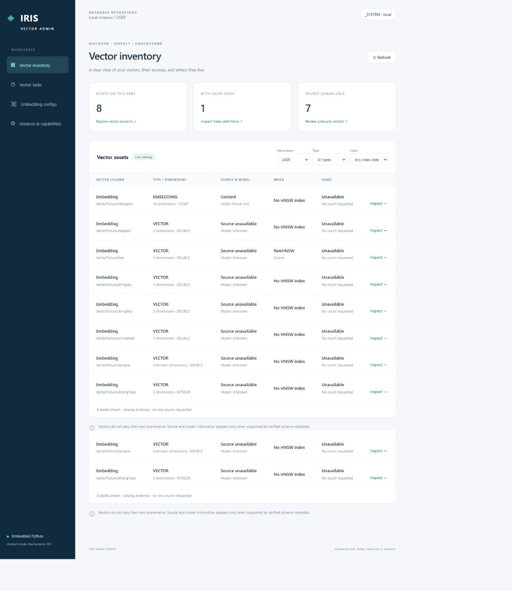
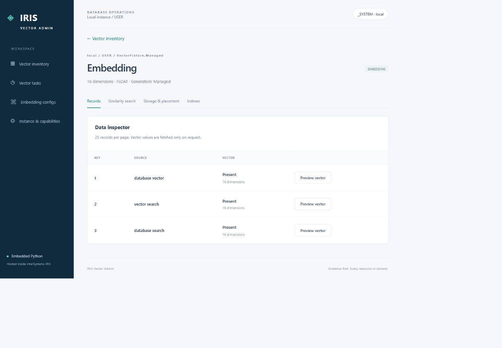
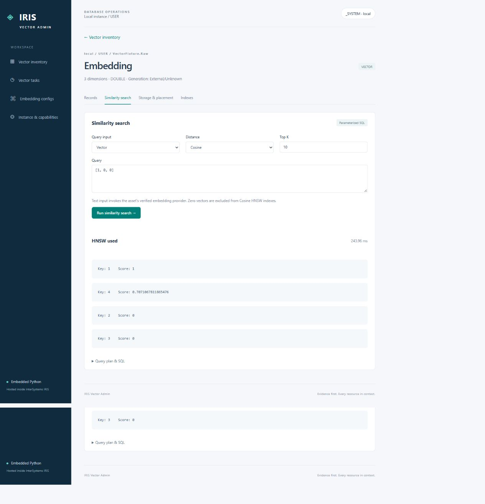
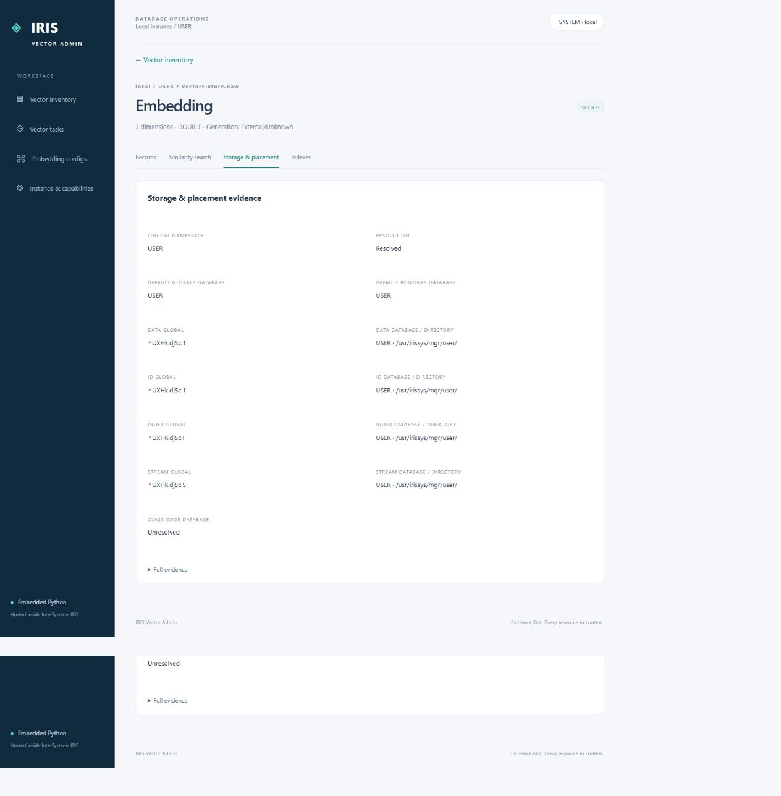
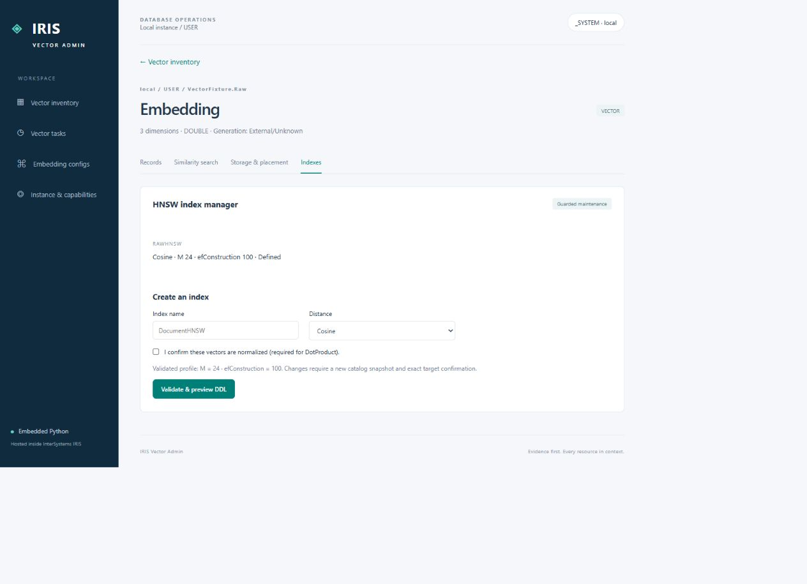
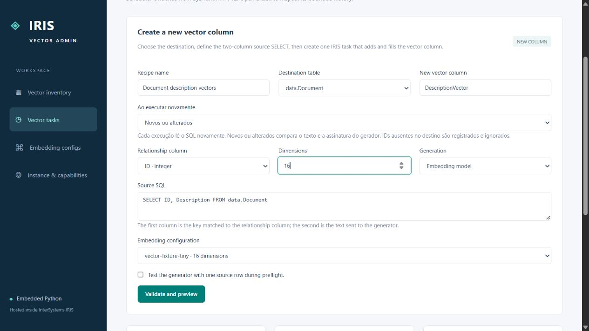
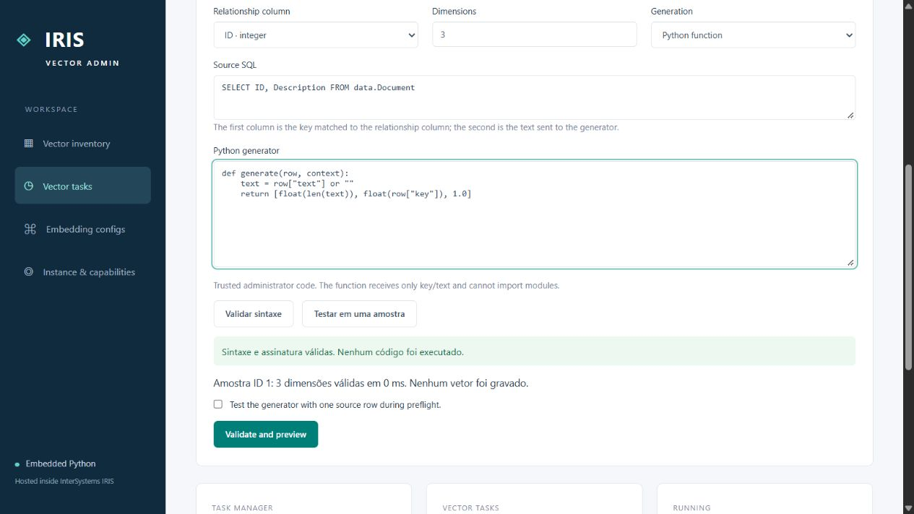
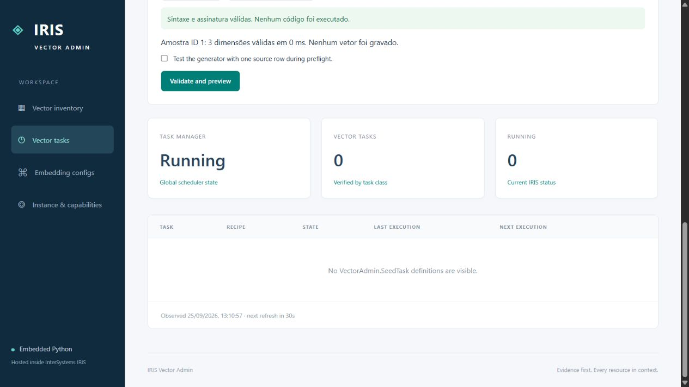
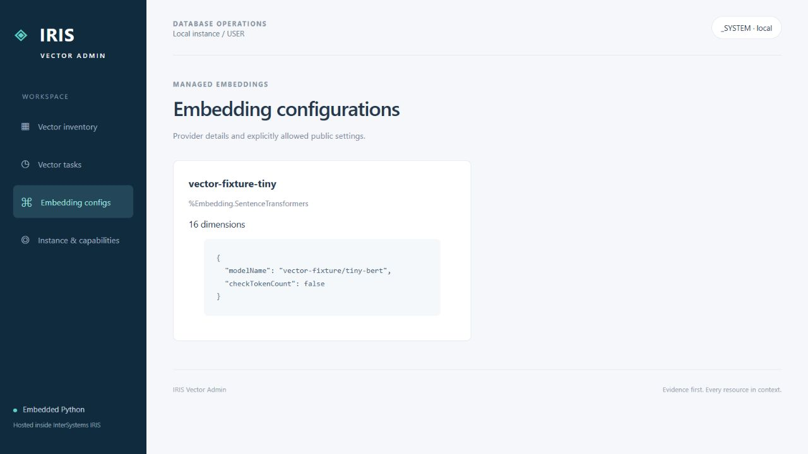
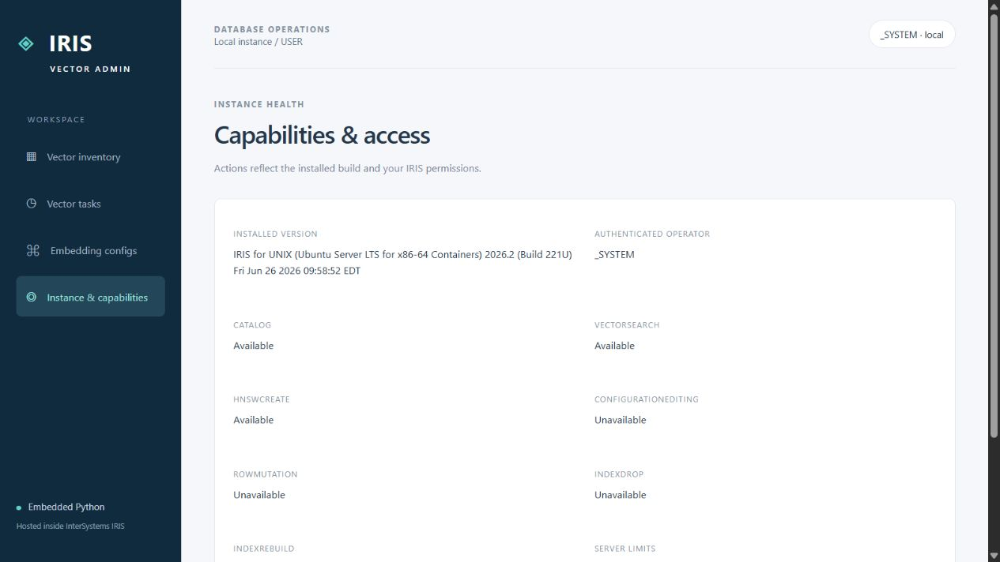

# IRIS Vector Management

## Overview

Turn vector data into something you can inspect, understand, and operate. IRIS Vector Management brings vector discovery, storage evidence, similarity search, guarded HNSW creation, and repeatable vector-generation tasks into one portal hosted inside InterSystems IRIS. Start with an existing table, select the text to encode, and create a vector column using an embedding model or your own Python function—without running a separate application server.



Built with IRIS Embedded Python, native SQL, dictionary metadata, and SysAdmin API v2. This release targets the pinned **IRIS Community 2026.2 Build 221U** image, not every IRIS release. Screenshots show the local demo; some newer task controls currently have Portuguese labels.

## Features

- Discover `VECTOR` and managed `EMBEDDING` columns, dimensions, model bindings, and HNSW indexes.
- Browse records with keyset pagination and fetch bounded vector previews on demand.
- Search by vector or managed text, with SQL and actual query-plan evidence.
- Trace namespaces, storage globals, database mappings, and database directories.
- Validate and create eligible HNSW indexes through explicit confirmation.
- Add a vector column to an existing table and populate it through one IRIS task.
- Use a registered embedding configuration or trusted Python code with syntax validation and sample testing.
- Rerun tasks for all rows, changed rows, or missing vectors; inspect scheduler history and run counters.

## Install and try it

### 1. Prerequisites

Install Git and Docker with Compose v2 and Linux-container support; Docker Desktop is suitable on Windows. The first build downloads IRIS and CPU machine-learning dependencies, so allow time and disk space for a large image. Running the portal requires no separate Python, Node.js, or front-end build.

### 2. Clone and configure

```sh
git clone https://github.com/Davi-Massaru/iris-vector-management.git
cd iris-vector-management
```

Copy `.env.example` to `.env`: use `Copy-Item .env.example .env` in PowerShell or `cp .env.example .env` in Bash. Keep `WITH_FIXTURES=1` for this tutorial; `0` omits the demo fixtures and their SentenceTransformers dependencies.

### 3. Set the local demo password

Create `.local/iris-password.txt` containing a strong password on one line, saved as UTF-8 without a BOM. Compose mounts it as a secret; the startup script sets the local `_SYSTEM` password. The image contains no baked-in human password, and `.local/` is ignored by Git—do not share this file.

```powershell
# PowerShell: create the directory, then enter the password in your editor.
New-Item -ItemType Directory -Force .local
notepad .local/iris-password.txt
```

On Linux/macOS, use `mkdir -p .local`, create the same file with your editor, and restrict its permissions with `chmod 600 .local/iris-password.txt`.

### 4. Build and start

```sh
docker compose up -d --build
docker compose ps
docker compose logs -f iris
```

Wait for startup to finish and the service to become healthy. Press `Ctrl+C` to stop following logs without stopping the container. Open [the local portal](http://localhost:52773/vector-admin/) and sign in as `_SYSTEM` with your configured password. This account is convenient for the local demo; use scoped accounts for real deployments. Compose binds port 52773 to loopback only.

### 5. Explore the included data

The default build creates `data.Document` with **20 Faker-generated documents**, sample vector tables, and the `vector-fixture-tiny` embedding configuration. Seeding happens during the build, not through a portal screen. The tiny 16-dimensional model is an offline, randomly initialized fixture: it tests the pipeline without an external model API key, but is **not a semantic-quality benchmark**.

### 6. Create your first vector column

Open **Vector tasks** and enter the example below. Check the sample-test checkbox, click **Validate and preview**, review the proposed operation, enter the exact target confirmation, and select **Publish and create task**. Publishing creates an on-demand task; its **Run now** action adds the column and populates matching rows.

| Field | Example |
| --- | --- |
| Recipe name | `Document description vectors` |
| Destination table | `data.Document` |
| New vector column | `DescriptionVector` |
| Relationship column | `ID` |
| Dimensions | `16` |
| Generation | `Embedding model` |
| Embedding configuration | `vector-fixture-tiny` |
| Rerun policy | `Novos ou alterados` (`CHANGED`) |
| Source SQL | `SELECT ID, Description FROM data.Document` |

Refresh inventory after completion to inspect `data.Document.DescriptionVector`. Run the **same task** again to test repeatability: with `CHANGED` and unchanged input/generator, rows should be skipped. A new recipe creates a new column; it is not how you rerun an existing column's task. If the demo model cannot initialize in your environment, use the three-dimensional Python example below to exercise column creation independently.

> **Data lifecycle:** this Compose configuration has no persistent database volume. `docker compose stop` and `docker compose start` preserve the same container; removing or recreating it can discard runtime data, recipes, tasks, and indexes. Back up important data before `down`, rebuilds, or recreation, and configure persistence before using this outside a disposable demo.

## Screen guide

### Vector inventory

Select a namespace and filter by type or index state, then click **Inspect** on a column. Counters apply to the current page; row totals are intentionally not queried. The Python catalog reads compiled IRIS dictionary metadata through `/api/instances/local/namespaces/{namespace}/vectors`, displaying dimensions, verified source/model bindings, and indexes. **Unknown** means provenance is not established: an ordinary vector column does not inherently remember its generator.


### Records

Open an asset's **Records** tab to browse 25 records per page and click **Preview vector** for a bounded numeric preview. Managed embeddings show verified source text; unbound vectors do not invent a source mapping. The Embedded Python explorer uses keyset-paged SQL and separate row/preview API requests, keeping full vectors out of the initial response.



### Similarity search

Choose the input mode, distance, and Top K, then run the query; try `[1, 0, 0]` on `VectorFixture.Raw`, or text `vector search` on `VectorFixture.Managed` when its provider is available. Parameterized SQL uses `TO_VECTOR` or `EMBEDDING` with native `VECTOR_COSINE`/`VECTOR_DOT_PRODUCT`. Expand **Query plan & SQL** to inspect `EXPLAIN`: an index's existence does not prove its use, so the diagnosis may be **HNSW used**, **Full scan**, or **Undetermined**.



### Storage & placement

Use **Storage & placement** to answer “where does this vector live?” through namespace defaults, class storage globals, mappings, database names, and directories; expand **Full evidence** for details. This read-only view combines IRIS dictionary storage metadata with allowlisted SysAdmin namespace, mapping, and database requests. Unresolved information remains explicit; the screen does not move data or edit database configuration.



### Indexes

Open **Indexes**, review eligibility, enter a name such as `DocumentHNSW`, select a distance, and click **Validate & preview DDL** before confirming the exact target. The backend checks fixed-dimension floating-point vector types, storage/ID constraints, and existing indexes; short-lived single-use proposals, catalog revalidation, asynchronous DDL, and auditing guard creation. The validated profile is `M=24`, `efConstruction=100`; DotProduct requires normalized vectors, and drop/rebuild are not enabled.



### Vector tasks: create a column

Choose an existing destination table, a **new** column name, a relationship column, and a two-column SQL query: the first value identifies the row, and the second is the text to encode. Select a model or Python generator, test a sample, and publish with exact-target confirmation, then click **Run now**. The `/api/vector-recipes` endpoints manage versioned recipes and preflight; `VectorAdmin.SeedTask` calls Embedded Python to create `VECTOR(DOUBLE, n)` when needed and update matching destination rows.

The accepted source shape is `SELECT Key, Text FROM schema.table`, without aliases, joins, expressions, filters, or a trailing semicolon. Source and destination may differ, but relationship values must match; choose a stable unique destination key such as `ID`. Missing destination keys are counted and skipped: this populates/updates vectors, **not new document records**.



### Vector tasks: Python editor

Select **Python function**, set dimensions, and edit `generate(row, context)`; **Validar sintaxe** checks code and **Testar em uma amostra** executes one sample without saving its vector. The front end calls server-side AST/compile validation with line/column feedback; `/api/python/test` verifies output shape. The function receives `row["key"]`, `row["text"]`, and `context["dimensions"]`, must return that many finite numbers, and cannot import modules. These restrictions are **not a security sandbox**: run trusted administrator code only.

Example for **3 dimensions** (numeric features for testing, not semantic embeddings):

```python
def generate(row, context):
    text = row["text"] or ""
    return [float(len(text)), float(row["key"]), 1.0]
```



### Vector tasks: monitoring and reruns

Below the creation form, run an existing task and open its detail/history panel to inspect scheduler status plus selected, created, updated, skipped, missing-target, and failed counts. Polling combines SysAdmin task-manager/info/history responses with `VectorAdmin.SeedRun` evidence. Each run reads the SQL again using the published generator and policy; per-target locks prevent overlapping writers, and checkpoints record progress. Commits occur per row, so earlier writes may survive a failed run.

| Policy in the UI | Behavior on another execution |
| --- | --- |
| `Novos ou alterados` / `CHANGED` | Process new or changed input/generator signatures; skip unchanged rows. |
| `Regerar todos` / `ALL` | Generate again for all selected rows with matching destinations. |
| `Somente sem vetor` / `MISSING` | Populate only missing destination vectors. |

“Created” counts newly populated vectors, not inserted documents. The current UI creates on-demand tasks and supports repeated **Run now** executions; it has no recurring-schedule editor, deletion, suspension, or cancellation controls.



### Embedding configurations

Open **Embedding configs** to inspect configuration names, provider classes, dimensions, and allowed public settings before choosing a task's model. The read-only `/api/instances/local/embedding-configs` endpoint queries `%Embedding.Config` and exposes approved settings rather than credentials. Provider creation/editing is outside this screen; a task using a model still writes an ordinary vector column, not an automatically source-bound managed embedding property.



### Instance & capabilities

Open **Instance & capabilities** to check the installed build, operator, permissions, supported actions, and limits when a control is unavailable. The capability endpoint combines installed-version evidence with role checks. Disabled functions are intentional gates: generic record editing, configuration editing, and index drop/rebuild remain unavailable, even though authorized tasks can populate their own vector columns.



## How it is built

Plain HTML, CSS, and JavaScript call a same-origin Python WSGI application hosted by IRIS (`%SYS.Python.WSGI`). Embedded Python reads dictionary metadata and executes SQL; administrative evidence and task operations use the local SysAdmin API. `VectorAdmin.SeedTask`, an IRIS task class, invokes the Python runner. There is no Flask service, separate application server, or frontend build toolchain.

| Layer | Implementation |
| --- | --- |
| Screens | `vector_admin/static/` |
| Routing, authorization, limits | `app.py`, `auth.py`, `settings.py` |
| Discovery, records, search, placement | `catalog.py`, `explorer.py`, `search.py`, `placement.py` |
| Guarded HNSW maintenance | `indexes.py` |
| Recipes, validation, task execution | `recipes.py`, `generators.py`, `seed_runner.py`, `tasks.py` |
| Installation and demo seeding | `Dockerfile`, `tools/`, `vector_admin/documents.py` |

Python module names in this table are relative to `vector_admin/` unless stated otherwise.

### SysAdmin API integration

The integration follows the [SysAdmin API v2 specification](https://github.com/intersystems-community/sysadmin-api-specification/blob/master/mainspec_v2.json), pinned by [vendor/sysadmin-revision.txt](vendor/sysadmin-revision.txt); see the generated [API map](docs/sysadmin-api-map.md). Monitoring uses `/v2/tasks`, `/v2/task`, `/v2/task/info`, `/v2/task/manager`, and `/v2/task/history`; creation/execution use `POST /v2/task` and `POST /v2/task/run`. Vector SQL and custom recipe/run records are application responsibilities, not SysAdmin vector endpoints.

### Access and safety

| IRIS role | Portal resources |
| --- | --- |
| `VectorAdminReader` | Read |
| `VectorAdminMaintainer` | Read + Maintain |
| `VectorAdminAdministrator` | Read + Admin; does **not** automatically imply Maintain |

Portal roles supplement native IRIS SQL/database and SysAdmin privileges. Grant only the permissions needed for the chosen tables, embedding providers, and task operations. Mutation flows include authorization, CSRF protection, explicit confirmation, and auditing; syntax validation does not make arbitrary administrator code safe. Review TLS, authentication, persistence, backups, and least privilege before deployment.

## Troubleshooting

| Symptom | What to check |
| --- | --- |
| Compose cannot mount `iris_password` | Create the one-line UTF-8 `.local/iris-password.txt` before starting. |
| Login fails | Use the configured secret and check startup logs for password-script errors. |
| `data.Document` absent from task selector | Check `WITH_FIXTURES=1`, namespace `USER`, and table visibility. Vector inventory shows it only after it has a vector column. |
| `TARGET_EXISTS` | Rerun the original task, or use another name for a genuinely new column. |
| Source SQL rejected | Use two bare columns and one qualified table; omit aliases, filters, joins, and semicolons. |
| Python sample rejected | Check syntax, finite values, output dimensions, and a nonempty source. |
| Text search unavailable | It requires a verified managed source/config binding; ordinary vector columns support numeric search. |
| Source/model is Unknown | Schema metadata does not establish provenance; it does not mean the vector is empty. |
| `QUERY_LIMIT` on startup | Allow startup to settle and retry once; investigate persistent query-cost/log issues instead of removing limits. |
| Managed search reports `QUERY_FAILED` | Check provider initialization, runtime dependencies, and IRIS logs; use the raw-vector fixture to test search independently. |
| Task skips or fails | Inspect scheduler history and seed-run evidence; missing relationship keys do not create destination records. |

## Verification and further reading

Run the Python tests inside the image:

```sh
docker compose exec -T -w /usr/irissys/csp/vector-admin iris python3 -m unittest discover -s tests -v
docker compose config --quiet
```

With Node.js installed locally, `node --check vector_admin/static/app.js` checks frontend syntax. Integration/acceptance scripts under `tools/` exercise the installed catalog, embeddings, indexes, and tasks; some modify demo data, so inspect them before running against a valued instance. The optional scale fixture is capped at 500,000 rows and is not created by the normal build.

See [spec.md](spec.md) for design and acceptance goals; this README describes the implemented release, not every future specification item.
