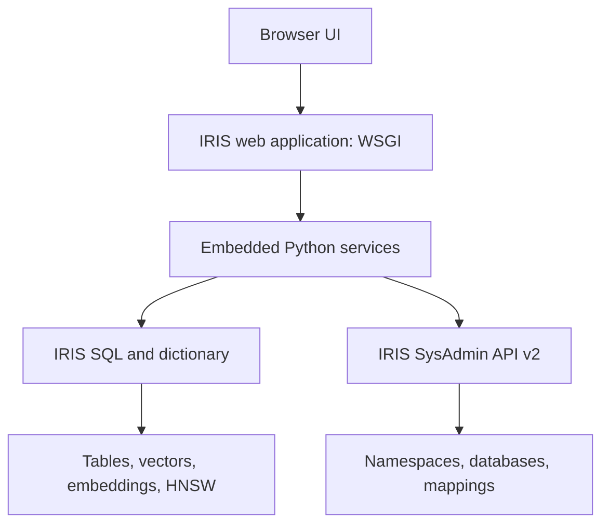
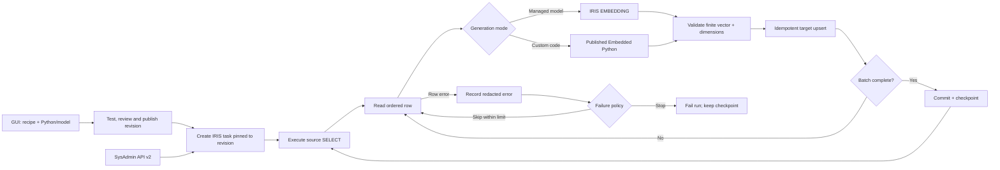
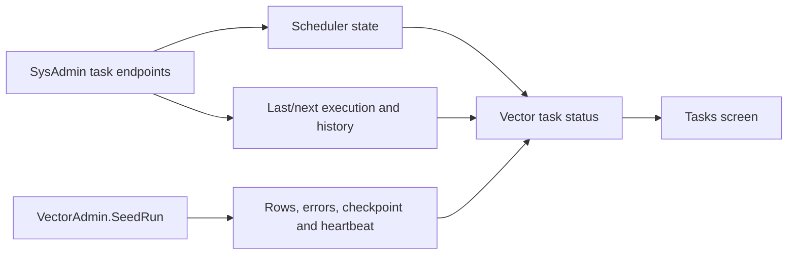

# SPEC — IRIS Vector DB Management Portal

**Status:** Implementation map  
**Language:** English  
**Target:** InterSystems IRIS 2026.2 Community Edition; verify capabilities against the installed image  
**Architecture:** IRIS-hosted WSGI application, Embedded Python, browser UI  
**Primary requirement:** [DPI-I-557 — GUI for Vector DB Management](https://ideas.intersystems.com/ideas/DPI-I-557)  
**Administrative contract:** [`mainspec_v2.json`](https://github.com/intersystems-community/sysadmin-api-specification/blob/master/mainspec_v2.json)

## 0. COMMAND

Build an IRIS administration portal that lets a DBA discover, inspect, query and control vector resources and their source data. The portal MUST use the SysAdmin API contract for administrative context and native IRIS SQL for vector capabilities absent from that contract. The running backend MUST be a WSGI callable hosted by an IRIS web application. Python code MUST execute in IRIS Embedded Python. The browser may use HTML, CSS and JavaScript; there MUST be no Java/Quarkus backend, external Flask/Waitress server, separate vector database or framework-managed shadow copy of vector records.

The portal MUST remain useful when the database contains externally generated `VECTOR` values with no stored text. Show the facts IRIS knows. Label unknown source, model and provenance as **Unknown**. Never infer source text or model from a numeric vector.

The first operational release MUST include inventory, a bounded row explorer, similarity search, index diagnostics and a guarded HNSW creation workflow. The next operational release MUST add managed vector recipes: an administrator selects a source query, target storage, embedding mechanism and IRIS Task Manager schedule, then can seed or incrementally refresh vectors with checkpoints and evidence. Configuration editing, generic record mutation, index rebuild/drop and multi-instance orchestration follow only after their acceptance gates.

## 1. SITUATION AND OBJECTIVE

DPI-I-557 describes difficulty tracking the raw information behind stored vectors and calls for granular management similar to a traditional DB management system. A vector database GUI therefore has to show real records, associated source information when it exists, schema and index state, and search behavior. A dashboard of counts or a chatbot alone does not satisfy the objective.

The contest calls for a GUI powered by IRIS management APIs and permits additional useful screens. This specification deliberately covers product behavior and engineering gates; it contains no instructions for promotional or submission materials.

**Success condition:** On a seeded IRIS instance, an administrator can locate a vector column, identify its logical namespace and supported physical-storage evidence, inspect one record without bulk-fetching vectors, run a parameterized nearest-neighbor query, see whether HNSW was used, and create an eligible index through a validated and audited operation.

## 2. RULES OF ENGAGEMENT

1. **One backend:** IRIS web application → WSGI callable → Embedded Python → IRIS SQL and the SysAdmin HTTP API. Do not start a second application server.
2. **Contract precedence:** Use an endpoint from `mainspec_v2.json` when it provides the requested administrative operation. Use SQL, dictionary metadata and IRIS APIs for vector-specific operations the contract does not expose. Never fabricate a SysAdmin vector endpoint.
3. **Version evidence:** On startup, record the IRIS version and installed capabilities. Hide unsupported actions; explain the prerequisite. Documentation examples are not proof that an operation works on every deployed version.
4. **Read first:** Inventory and inspection are enabled by default. Writes require an explicit role, a per-resource dry run, a confirmation naming the exact target and an audit record.
5. **Least privilege:** Separate read, vector maintenance and portal administration permissions. Apply IRIS SQL object permissions, SysAdmin privileges and `%USE_EMBEDDING` where required. A WSGI route permission check supplements IRIS authorization; it never replaces it.
6. **Bounded execution:** Enforce page size, top-K, preview size, query timeout and operation concurrency on the server. Never run an unbounded `SELECT *` against vector rows.
7. **No invented lineage:** A `VECTOR` value does not inherently identify the model, source text or upstream document. Such fields require a registered mapping or an `EMBEDDING` definition that exposes them.
8. **Transparent location:** Logical namespace, data global, index global, mapped database, routine/class code location and filesystem database directory are distinct concepts. Show each independently or show `Unresolved` with the reason.

## 3. DEPLOYMENT TOPOLOGY



Configure a dedicated IRIS web application, for example `/vector-admin`, with **Enable = WSGI**, the module containing the callable, the callable name, the WSGI app directory and a fixed administrative namespace. Do not enable unauthenticated access. Follow IRIS's WSGI authentication and session model. Use relative browser URLs under the web-application prefix. Bundle static assets; do not depend on an external CDN at runtime.

The WSGI callable supplies a small route layer. Suggested modules:

```text
vector_admin/
  app.py                   # WSGI callable, middleware, routing
  auth.py                  # principal, roles, CSRF, scope checks
  capabilities.py          # version and feature checks
  sysadmin_client.py       # allowlisted requests matching mainspec_v2.json
  sql.py                   # bound values, validated identifiers, timeouts
  catalog.py               # vector and embedding metadata
  placement.py             # storage/global/mapping resolver
  explorer.py              # paged row and vector preview
  search.py                # exact and ANN query, EXPLAIN
  indexes.py               # HNSW validation and controlled DDL
  configs.py               # sanitized embedding configuration views
  audit.py                 # append-only operation records
  static/                   # browser UI assets
```

Access local IRIS data through the supported Embedded Python `iris` SQL facility. Make server-side SysAdmin HTTP requests through an allowlisted client to the configured IRIS admin endpoint. Verify authentication behavior on the target image; do not expose admin credentials to the browser, log them, or assume the WSGI user's session automatically authorizes a separate HTTP request. For future remote instances, isolate credentials and failures per instance and keep each action targeted to one instance unless an explicit multi-target operation is designed.

## 4. SOURCE-OF-TRUTH MATRIX

| Portal capability | Authoritative source | Required implementation decision |
| --- | --- | --- |
| Instance/version/health | IRIS administrative interface and version APIs | Probe at startup; record capability state. |
| Database inventory and physical directory | SysAdmin API v2 database operations | Map response fields exactly to the checked-in contract. |
| Namespace defaults | SysAdmin API v2 namespace operations | Distinguish globals and routines defaults. |
| Global/routine/package mappings | SysAdmin API v2 namespace mapping operations | Resolve data, index and code separately. |
| Schema, tables, vector columns | IRIS SQL catalog / dictionary | Discover actual `VECTOR` and `EMBEDDING` definitions. |
| `%Embedding.Config` | IRIS SQL | Read provider, vector length and sanitized configuration. |
| HNSW definition and parameters | IRIS SQL catalog / class dictionary | Verify exact metadata fields on the target image. |
| Record preview and similarity | IRIS SQL | Use bound values and server-built, allowlisted identifiers. |
| Query plan | IRIS SQL `EXPLAIN` | Report index use only from the actual plan. |
| Create/rebuild/drop index | IRIS SQL DDL | Gate by role, eligibility, preflight, audit and verification. |
| Database creation and database attributes | SysAdmin API v2 `/v2/database` or `/v2/database-dir` family | Use only when the operator explicitly requests a portal-owned database; never create storage as a side effect of saving a recipe. |
| Namespace defaults and global mappings | SysAdmin API v2 namespace and mapping operations | Show effective placement before writes; mapping changes are separate guarded operations. |
| Scheduled vector refresh | SysAdmin API v2 `/v2/task*` operations backed by a portal task class | The API owns scheduling and history; the portal recipe owns vectorization semantics and checkpoints. |
| Seed run progress | Portal-owned run/checkpoint tables plus Task Manager history | Do not confuse a successful task launch with a successful or complete seed. |
| Task Manager health | SysAdmin API v2 `GET /v2/task/manager` | If the manager is not `Running`, scheduled recipes are blocked even when their individual definitions are valid. |
| Vector task lifecycle | SysAdmin API v2 `GET /v2/tasks`, `/v2/task`, `/v2/task/info`, `/v2/task/upcoming` and `/v2/task/history` | Filter to the portal task class/settings and correlate by IRIS task id; never infer row progress from scheduler state. |

**Contract verification gate:** Before coding `sysadmin_client.py`, obtain the exact `mainspec_v2.json` revision used by the project, record its commit hash and generate `docs/sysadmin-api-map.md` containing the actual HTTP method, path, parameters, response fields and required privileges for every called operation. Candidate families are `/v2/databases`, `/v2/namespaces` and namespace mapping endpoints. Their spelling and response fields MUST be copied from the file, not from an earlier draft of this specification. A failed contract check blocks the dependent feature; SQL MUST NOT silently replace an existing administrative API solely because the API call failed.

**Evidence boundary:** The GitHub page lists `mainspec_v2.json`, but the full raw contract was unavailable for direct inspection while this document was prepared. Therefore this specification names endpoint families only; no unverified exact method/path pair is asserted as implemented.

## 5. DOMAIN MODEL

| Object | Required fields | Rule |
| --- | --- | --- |
| `Instance` | id, label, IRIS version, capability state | Never merge resources from different instances. |
| `Namespace` | instance, name, default globals DB, default routines DB | Namespace is logical visibility, not a physical database. |
| `VectorAsset` | instance, namespace, schema, table, column, type, element type, dimensions | Stable discovery key; a table can have several assets. |
| `EmbeddingConfig` | name, provider class, dimensions, redacted model metadata | Never return credentials or raw configuration secrets. |
| `SourceBinding` | kind, source columns, primary key, optional documented metadata columns | `EMBEDDING` binding comes from schema; `VECTOR` binding is opt-in. |
| `VectorIndex` | name, table, column, distance, M, efConstruction, status | Display `Unknown` for fields absent from validated metadata. |
| `Placement` | storage class, data/id/index/stream globals, resolved databases, evidence | Resolution may be partial. |
| `Operation` | actor, scope, action, target, proposal, state, timestamps, outcome | Never treat an HTTP success alone as verification. |
| `VectorRecipe` | id, name, namespace, source query definition, stable key, text inputs, target mode, embedding mechanism, model fingerprint, write policy, deletion policy, state, revision | Immutable revisions; editing an active recipe creates a new draft revision. |
| `PythonGenerator` | id, name, revision, source code, entry point, dependency profile, input/output contract, author, review state, code digest, timestamps | Administrator-authored code is versioned, tested and published independently; a task pins one immutable revision. |
| `VectorTarget` | mode, schema/table/column, key mapping, element type, dimensions, storage database, globals and index policy | Existing-column and portal-owned sidecar-table modes have different safety rules. |
| `SeedSchedule` | recipe revision, IRIS task id, schedule, enabled state, concurrency policy | One task points to exactly one published recipe revision. |
| `SeedRun` | id, recipe revision, task id, mode, state, checkpoint, counts, timestamps, model fingerprint, error summary | A run is append-only operational evidence; retries create attempts, not duplicate rows. |

Persist only portal-owned registrations, snapshots and audit data in a dedicated schema, for example `VectorAdmin`. Do not duplicate all source rows or embeddings. Do not add text columns to application tables merely to make the UI work. `SourceBinding` may point to existing text and metadata columns with an explicit join recipe only when validated and authorized.

For a raw `VECTOR` asset show **Generation: External/Unknown** until provenance is registered. For `EMBEDDING`, show its configured model, provider and source columns discovered from actual schema metadata. Provider availability and generation success remain separate health checks.

### 5.1 Ownership boundary

Every asset MUST be classified as `DISCOVERED`, `REGISTERED` or `PORTAL_MANAGED`.

- `DISCOVERED` means the portal found the column but has no generation recipe. It is read-only except for independently authorized index operations.
- `REGISTERED` means an administrator documented an external producer and optional source binding. The portal may monitor freshness but MUST NOT regenerate it.
- `PORTAL_MANAGED` means the portal owns a published recipe and may seed or refresh the target through the task runner.

Registration never changes storage ownership. A recipe MUST point to one target asset and one namespace; it cannot issue cross-namespace writes in a single run.

## 6. RESOURCE DISCOVERY AND PHYSICAL PLACEMENT

### 6.1 Discovery algorithm

1. Select instance and logical namespace. Verify capability and read access.
2. Enumerate application schemas and tables from IRIS SQL metadata. Detect `VECTOR` and `EMBEDDING` columns. Exclude system schemas unless requested by a privileged administrator.
3. Read the declared vector element type and fixed dimension where exposed. Validate the SQL catalog fields and datatype representation against a `VECTOR` fixture and an `EMBEDDING` fixture on the target IRIS image. Do not parse dimensions from display strings without a tested fallback.
4. Resolve every index attached to the asset and identify HNSW from its actual index class/type; load `Distance`, `M` and `efConstruction` if exposed.
5. For `EMBEDDING`, identify source columns and configuration, then resolve `%Embedding.Config`. Mask API keys and other secret-valued fields in every response.
6. Return inventory in bounded pages with filters for namespace, schema, type, indexed/unindexed and configuration. Count expensive totals asynchronously or label them estimates.

### 6.2 Placement algorithm

1. Obtain namespace default global and routine databases using the SysAdmin API.
2. Resolve SQL table to its persistent class and storage definition. Read data, ID, index and stream global locations when available. **Do not derive global names from table names.**
3. Obtain applicable global mappings. Resolve the effective data DB and effective index DB independently, honoring actual mapping precedence, including subscript-level behavior if present. If the resolver cannot prove the placement, show `Unresolved` and the evidence collected.
4. Resolve routine/package mappings for class code separately. A code mapping does not establish the data database.
5. Obtain physical database path only from the database inventory. Do not claim a vector index occupies one named global unless the storage definition and mapping prove it.
6. If two namespaces expose the same physical table/global on one instance, show two logical views linked to one proven physical resource. Never deduplicate across instances.

Example detail panel:

```text
USER / RAG.DocumentChunk / Embedding
Type: EMBEDDING          Dimensions: 384
Source: Content          Config: local-mini-lm
Index: DocHNSW           Distance: Cosine
Logical namespace: USER  Default globals DB: USER
Data global: ^RAG.DocumentChunkD   Effective data DB: VECTORDB
Index global: Unresolved           Effective index DB: Unresolved
Code DB: APPCODE          Evidence: storage definition + mappings
```

The example is illustrative, not a claim about automatic global naming.

## 7. OPERATOR WORKFLOWS

### 7.1 Overview and inventory — P0

Show connection/privilege state, vector tables and columns, managed embedding configurations, HNSW indexes, and unresolved placement or metadata. Every number must link to its underlying inventory. A per-namespace table lists type, dimensions, source status, model/config status, index and row-count method (`Exact`, `Estimate` or `Unavailable`). Do not compute an exact `COUNT(*)` on every table during page load.

### 7.2 Data inspector — P0

Choose an asset; page records by stable primary key or ID. Show key, allowed scalar fields, source text if a binding exists, redacted metadata, null/vector presence and dimensions. Require a second user action to fetch a vector preview (first N values and norm where supported). Cap text length and number of values. Escape browser output. Keep source links and row-level SQL permissions intact. Disable row operations when no stable key is available.

The inspector MUST show `Source unavailable` for an unbound raw `VECTOR` and `Source null` for a bound but empty source. Never present a generated explanation as stored source.

### 7.3 Search playground — P0

Support two query inputs:

- **Vector input:** validate numeric element type, finite values and exact dimensions; bind the serialized value through the supported `TO_VECTOR` form.
- **Text input:** enable only when an `EMBEDDING` configuration or an explicitly registered external encoder exists; bind text to `EMBEDDING(?, configuration)` as supported on the installed release. Do not call a model implicitly for an unknown raw `VECTOR`.

User selects asset, distance function, top-K within a configured bound, and optional filters from a server allowlist of typed columns and operators. Build SQL from catalog-validated identifiers; bind all values. Require `TOP K`, matching `ORDER BY VECTOR_COSINE(...) DESC` or `VECTOR_DOT_PRODUCT(...) DESC`, and a compatible index distance for an indexed run. Show scores, associated records, elapsed time and the SQL plan. Label `HNSW used`, `Full scan` or `Undetermined` from `EXPLAIN`; index existence is insufficient. Limit provider calls, CPU-heavy exact scans and concurrent searches. For Cosine, warn that zero vectors are excluded from a Cosine HNSW index.

### 7.4 HNSW manager — P0 create; P1 rebuild/drop

List definition and verified metadata. Before showing **Create**, require: fixed-length vector/embedding column; element type accepted by the installed IRIS version; bitmap-supported IDs; default table storage; permitted SQL privileges; compatible `Distance`; absent conflicting index. The current 2026.2 vector-search documentation specifies fixed-length `DOUBLE` or `DECIMAL` for HNSW, bitmap-supported IDs and default storage. Test actual target-version behavior; do not assume a `VECTOR(FLOAT, 384)` fixture is HNSW-eligible. `DotProduct` requires an explicit normalized-vectors claim/verification. Validate `M` and `efConstruction` against installed-version limits rather than copying older community examples.

Create workflow: inventory snapshot → eligibility → generated DDL preview → named confirmation → execute once → read catalog again → run a representative `EXPLAIN` → audit result. If metadata changes between preview and execution, abort and repeat preflight. For rebuild and drop, show expected impact, target index, maintenance window and dependent queries. Use an operation state machine (`PREPARED`, `RUNNING`, `SUCCEEDED`, `FAILED`, `UNKNOWN`) and record partial or uncertain outcomes for inspection. A schema/index operation MUST NOT be issued to several instances by a generic retry loop.

Illustrative 2026.2 DDL, subject to the fixture gate:

```sql
CREATE INDEX DocumentEmbeddingHNSW
ON TABLE RAG.DocumentChunk (Embedding)
AS HNSW(Distance='Cosine', M=24, efConstruction=100)
```

### 7.5 Embedding configurations — P1

Read `%Embedding.Config` to display name, provider class, dimension, nonsecret model settings and number of referencing columns. Distinguish `%Embedding.OpenAI`, `%Embedding.SentenceTransformers` and custom `%Embedding.Interface` implementations. Parse JSON on the server through a strict redaction allowlist; never return the raw `Configuration` field. A test-generation action requires `%USE_EMBEDDING`, a rate limit and a clear indication of external provider calls. Configuration edits are separate guarded commands; show affected columns and forbid deletion while referenced unless the installed IRIS semantics and explicit migration plan support it.

### 7.6 Source data mutation — P2

Editing/deleting a row can invalidate source, embedding, indexes, downstream references or application behavior. Implement only for explicitly registered, supported schemas with stable keys, ownership policy and transactional update rules. Preview old/new scalar values, target row, affected source binding and expected embedding behavior. Use optimistic concurrency; verify the record after commit. Never offer generic `DELETE FROM arbitrary_table` or write a vector column by accepting unchecked array text.

### 7.7 Multi-instance scope — P2

Retain instance → namespace → database → table as a navigable model. When more than one IRIS instance is configured, display inventories side by side and compare dimension, model/config and index definition. Return independent errors per instance. Multi-instance writes require an explicit selected-target list, preflight for each and per-instance result; there is no cross-instance atomic transaction.

### 7.8 Managed vector creation — P1

Provide a wizard that produces a versioned `VectorRecipe`; saving a draft performs no DDL, no model call and no scheduling. The workflow is:

The primary creation mode is **new column in an existing table**. The operator provides the destination table (for example `data.documents`), a new column name (for example `DescriptionVector`), the destination relationship column (`ID`) and a bounded source `SELECT` returning exactly two values per row: relationship key first and source text second (`SELECT ID, Description FROM data.documents`). The generator is either an IRIS embedding configuration or reviewed Embedded Python. The published IRIS task owns the complete operation: it creates `DescriptionVector VECTOR(DOUBLE, n)` when absent, reads source rows in stable-key order, generates one vector per row, and updates only the matching destination row using `WHERE ID = ?`. Creation and population therefore appear as one task run, while draft and preflight remain non-mutating.

The initial implementation accepts the deliberately narrow SQL shape `SELECT <key>, <text> FROM <schema>.<table>`. Joins, expressions and filters require the later prepared-query analyzer; they must not be accepted by merely concatenating browser SQL. The preflight verifies both source columns, the destination relationship column, absence of the requested vector column, model dimensions or Python output dimensions, and shows the exact `ALTER TABLE` statement before publication.



1. **Select scope.** Choose one instance and namespace. Show its default globals database, effective mappings and operator privileges.
2. **Define the source.** Choose a catalog table/view or submit a `SELECT` query. The portal prepares the query and executes a bounded preview. It MUST reject non-`SELECT` statements, multiple statements, stored procedure calls, dynamic SQL, comments used to hide a second statement and queries whose result shape cannot be proven. The source definition names a stable unique key, one or more text columns, optional metadata columns, an optional change cursor and an optional tombstone predicate. Values remain bound; identifiers come from the prepared result metadata and catalog.
3. **Choose the target.** Either select an eligible existing `VECTOR`/`EMBEDDING` column or request a portal-owned sidecar table. Existing-target mode requires an explicit key join and only updates the chosen column. Sidecar mode creates a table containing source key, vector, source hash, model fingerprint, source cursor, timestamps and run id; source text is not copied by default.
4. **Choose generation.** Use one of: IRIS managed `EMBEDDING(config, source)` semantics; SQL `EMBEDDING(?, config)` executed by the runner; a preinstalled encoder adapter; or a published `PythonGenerator` authored in the portal studio. Every mechanism returns a fixed-dimension finite numeric array and exposes its model/code revision, dimensions, batch limit and normalization behavior.
5. **Choose refresh policy.** Select `FULL_REBUILD`, `UPSERT_CHANGED` or `APPEND_ONLY`; batch size; failure threshold; missing-source behavior (`KEEP`, `MARK_STALE`, or `DELETE` where authorized); and whether an HNSW index is created after a successful initial seed.
6. **Preflight.** Re-read source/target metadata, sample bounded rows, test one embedding without persisting it, verify dimensions and permissions, estimate row volume when possible, resolve physical placement and show the exact DDL/DML template. Return a short-lived signed proposal bound to the recipe revision and catalog fingerprint.
7. **Publish.** With named confirmation, create approved portal-owned schema objects if needed and mark the recipe revision `PUBLISHED`. Scheduling is a separate explicit action.

For a portal-owned sidecar table, the operator selects an existing database or requests a dedicated database. Database creation, namespace mapping and table creation are three separately previewed operations. The portal MUST show: database logical name and physical directory; namespace; data, ID, index and stream globals; effective mappings; estimated size; journaling/encryption attributes exposed by the installed version; and rollback limits. It MUST NOT edit an application's storage definition merely to relocate vectors.

Default sidecar identity is `(RecipeId, SourceKey)` with an idempotent unique constraint. Composite or non-string source keys use a canonical typed encoding, not display concatenation. The target row also stores `SourceHash` and `ModelFingerprint`; equality of both permits a safe skip. Model fingerprint includes mechanism, provider/adapter class, configuration identity, model version, dimensions and normalization, but no secret.

### 7.8.1 Python generation studio

Provide a browser editor for privileged portal administrators to implement row-to-vector logic in Embedded Python. This is controlled server-side code deployment, not a general SQL/Python console. The editor has `Draft`, `Tested`, `Approved`, `Published` and `Retired` states. Only `Published` immutable revisions can be selected by a recipe or task. Editing published code creates a new draft and never changes a running or scheduled task.

The required entry point is:

```python
def generate(row, context):
    """Return a vector or a GenerationResult; do not persist data directly."""
```

`row` is a read-only mapping containing only aliases selected from the prepared source query. `context` exposes nonsecret recipe metadata, model client handles from an allowlist and structured logging with automatic redaction. It MUST NOT expose the raw IRIS connection, arbitrary SQL execution, filesystem APIs, process creation, environment variables, sockets, imports outside an approved dependency profile, portal signing keys or provider credentials. The runner, not user code, owns transactions, target writes, checkpoints and retries.

Accepted results are either a numeric sequence or `GenerationResult(vector, metadata, skip_reason)`. Metadata is bounded JSON and cannot contain source text, secrets or a second vector. Raising a typed `SkipRow` records a skip; any other exception follows the recipe's row failure policy. Output validation checks element type, finite values, exact dimensions and maximum serialized size before any write.

The studio workflow is:

1. Select a prepared source query and generate a typed sample schema plus starter function.
2. Edit code with syntax highlighting, linting and a visible list of permitted imports and context APIs.
3. Run syntax/compile validation without executing source data.
4. Run against explicitly selected, bounded sample rows in a disposable test context. Show redacted input shape, return type, dimensions, duration and error; never persist the test vector unless the administrator separately selects a test target.
5. Run contract tests for nulls, long text, non-ASCII text, timeout, invalid dimension, nonfinite values and deterministic replay when the generator declares itself deterministic.
6. Review the code diff, dependency profile, author, source-query shape, requested model/configuration and code digest. A separate approval role is REQUIRED in production mode; development mode may allow self-approval but labels it clearly.
7. Publish an immutable revision. Recipes store its id and digest; schedules pin the recipe revision, which pins the generator revision.

The initial implementation MUST support row mode: the task executes the source SQL in deterministic key order and calls `generate(row, context)` once for each row. The runtime may fetch rows in bounded batches, but the function observes one row and cannot control cursor advancement. A future batch entry point may be added only as a separate contract after ordering, partial failure and per-row result mapping are specified.

Repeatable recipes expose an explicit re-execution policy: `ALL` regenerates every matched destination row; `MISSING` only fills rows whose vector is null; `CHANGED` compares a hash of the normalized source value and generator/model fingerprint before regenerating. The portal persists these signatures per recipe and source key. A missing destination key increments `missing` and is skipped. A target write uses a single-row key predicate and counts the row as created or updated only after the database reports exactly one affected row. A per-target lease prevents overlapping runs of the same vector recipe.

The project build with fixtures enabled creates and populates `data.Document` with Faker automatically. Seeding is idempotent and never exposed as a portal screen or HTTP mutation endpoint. The table is selectable as the destination of a new vector column. Test scripts may append documents or change descriptions to verify subsequent task executions.

Embedded Python does not provide a complete hostile-code security boundary inside the IRIS process. Therefore the feature is restricted to a dedicated code-author role and trusted administrators. Static checks and restricted globals reduce accidents but MUST NOT be described as a sandbox. Production deployments SHOULD require reviewed signed revisions, an approved dependency image and a dedicated task user with least privilege. If untrusted end-user code is required, it MUST run outside the IRIS process in a separately isolated execution service; that is outside this portal's one-backend scope.

### 7.9 Seed and refresh execution — P1

A seed is a run of a published recipe, not a free-form SQL script. Implement `VectorAdmin.SeedTask` as a subclass of `%SYS.Task.Definition`; its only configurable portal setting is a recipe revision identifier (plus documented scheduling fields managed by IRIS). `OnTask()` invokes a stable ObjectScript entry point that enters the recipe namespace and calls the Embedded Python runner. Do not use `RunLegacyTask` or `ExecuteCode`. Python entered through the browser executes only after it becomes a reviewed, published `PythonGenerator` revision.

The runner uses keyset batches and commits per batch. It MUST:

- acquire a lease scoped to target asset; prevent overlapping runs of the same recipe and conflicting writes from different recipes;
- persist `SeedRun` before reading source rows and heartbeat/lease expiry during work;
- bind source cursor and key values, preserve deterministic key order and cap batch size, provider calls, runtime and error count;
- construct one read-only `row` mapping from each SQL result and invoke the pinned generator exactly once for that attempt;
- compute the source hash after deterministic text normalization and record the model fingerprint;
- validate every output for type, finiteness and exact dimension before an idempotent upsert;
- advance the durable checkpoint only after its batch commit; a retry restarts after the last committed checkpoint;
- record selected, embedded, inserted, updated, skipped, stale/deleted and failed counts without logging source text or vectors;
- finish as `SUCCEEDED`, `SUCCEEDED_WITH_ERRORS`, `FAILED`, `CANCELLED` or `UNKNOWN`, preserving the last safe checkpoint.

`FULL_REBUILD` MUST use a shadow generation or staging table for portal-owned sidecars and switch only after count/dimension/sample verification. It MUST NOT truncate a live target first. For an existing application column, full rebuild means bounded in-place batches and requires an explicit acknowledgement that mixed old/new model versions are visible during the run. HNSW handling is declared per recipe: keep and incrementally maintain, build after load, or guarded rebuild after cutover, subject to installed-version proof.

`UPSERT_CHANGED` requires a monotonic cursor or compares `SourceHash`; timestamp cursors alone are accepted only with a stable-key tie breaker. `APPEND_ONLY` never mutates an existing source key. Deletions are never inferred from a partial query. `MARK_STALE` or `DELETE` requires a complete-source assertion and a post-scan reconciliation phase.

Cancellation is cooperative between batches. A timeout or lost worker produces `UNKNOWN`, not an automatic retry. Resume is offered only when recipe revision, model fingerprint, source shape and target fingerprint still match the stored run. Otherwise the user starts a new run after preflight.

### 7.10 Task organization and operations — P1

Use the pinned SysAdmin contract as follows: `GET /v2/tasks` and `GET /v2/task` for inventory/details; `POST /v2/task` to create; `PUT /v2/task?id=...` to edit; `POST /v2/task/run?id=...` to run now or later; task suspend/resume endpoints for state; `GET /v2/task/history`, `/v2/task/upcoming`, `/v2/task/info` and `/v2/task/manager` for operational views. Honor the contract privileges: reads vary between `%Admin_Operate:U` and `%Admin_Task:U`; run requires `%Admin_Task:U`. Copy exact request/response fields into `docs/sysadmin-api-map.md` before implementation.

The Tasks screen groups schedules by target asset and recipe, and shows recipe revision, task id, next run, last run, last successful checkpoint, lag/freshness, model fingerprint and current lease. Task Manager history and `SeedRun` are correlated but remain separate evidence sources. Creating, editing, suspending, resuming, running or deleting a task requires its own preflight/audit event. Deleting a task never deletes its recipe, runs, vectors or target table.

Expose manual actions: `Preflight`, `Run now`, `Cancel`, `Resume from checkpoint`, `Clone recipe`, `Publish revision`, `Suspend schedule` and `Retire recipe`. `Retire` disables new runs but preserves history and target data. Destructive cleanup is a later, separately confirmed operation.

### 7.10.1 Vector task monitoring

The monitoring page MUST obtain IRIS scheduler state from the pinned SysAdmin API v2 contract. There is no vector-specific SysAdmin endpoint; vector tasks are identified only when `TaskClass` is the portal-owned `VectorAdmin.SeedTask` and the validated `Settings` contain a known recipe revision. A matching name alone is not sufficient.

Use the endpoints as follows:

| SysAdmin operation | Portal use | Contract evidence shown |
| --- | --- | --- |
| `GET /v2/task/manager` | Global scheduler banner and availability gate. | `Status`: `Running`, `Not running` or `Suspended`. |
| `GET /v2/tasks?filter=...&maxRows=...` | Bounded task inventory. Filter results again by task class/settings server-side. | `Id`, `Name`, `Type`, `Namespace`, `Suspended`, `LastFinished`, `NextScheduled`. |
| `GET /v2/task?id={taskId}` | Definition and schedule detail. | Task class, namespace, user, timeout, frequency/schedule, mirror policy, description and `Settings`. |
| `GET /v2/task/info?id={taskId}` | Current/last lifecycle and next execution. | `LastSchedule`, `LastStarted`, `LastFinished`, `Status`, `Error`, `NextScheduled`, `Suspended`. |
| `GET /v2/task/upcoming` | Calendar/list of upcoming vector jobs. | `Id`, `Name`, `Namespace`, `Datetime`, `Suspended`. |
| `GET /v2/task/history?taskId={taskId}` | Bounded execution history. | `LastStart`, `Completed`, `Status`, `Result`, `TaskId`, `Namespace`, `Pid`, error fields, user and log time. |
| `POST /v2/task/run?id={taskId}` | Run now or at the supplied time. | HTTP success means accepted by Task Manager, not seed completion. |
| `POST /v2/task/suspend?id={taskId}` / `resume` | Suspend or resume one schedule. | Re-read `/v2/task/info` after mutation to verify state. |

Do not use `/v2/async-result` to monitor a scheduled vector task: the task endpoints do not return an async GUID for `/v2/task/run`. Async-result endpoints may be used only when a future contracted operation explicitly returns such a GUID.

The server produces one normalized `VectorTaskStatus` from two evidence streams:



The normalized states are:

- `SCHEDULED`: definition is active, manager is running and a next execution exists.
- `SUSPENDED`: individual task or Task Manager is suspended; the UI states which one.
- `QUEUED`: a run-now request was accepted but no correlated `SeedRun` has started within the configured launch grace period.
- `RUNNING`: `/v2/task/info` reports running (`Status = -1`) and a correlated run has a fresh heartbeat.
- `STALE`: IRIS reports running but the correlated heartbeat is expired, or a run heartbeat exists after Task Manager no longer reports it running.
- `SUCCEEDED`, `SUCCEEDED_WITH_ERRORS`, `FAILED`, `CANCELLED` or `UNKNOWN`: terminal portal run state, accompanied by the unmodified Task Manager status/result.
- `UNLINKED`: an IRIS `VectorAdmin.SeedTask` refers to a missing/unknown recipe revision, or a portal schedule points to a missing IRIS task.

Correlation MUST use `(instanceId, taskId, scheduled/start time, recipeRevision)` and a runner-generated `SeedRunId`. `taskId` alone identifies a definition, not one execution. The task runner creates `SeedRun` as its first durable action and records task id, recipe revision, scheduled time when known, start time and IRIS job PID. History matching uses task id plus a bounded time window and MUST surface ambiguous matches rather than choosing silently.

The list view shows task name/id, target asset, recipe and generator revision, namespace, schedule, manager/task suspension, last IRIS status, portal run state, next execution, processed/total-or-unknown rows, failure count, last checkpoint and heartbeat age. The detail view shows the raw safe fields from each evidence source side by side and labels disagreements.

Refresh behavior is bounded polling: refresh the manager and inventory on page entry; refresh visible running/queued tasks every 5 seconds; back off to 15 then 30 seconds when unchanged; stop active polling when the page is hidden; and perform an immediate refresh after run/suspend/resume. Every list/history call supplies `maxRows`. Pagination or a time window is required; the UI never requests unlimited history. API errors produce `Monitoring unavailable` with the last successful observation timestamp, never a guessed state.

## 8. WSGI API CONTRACT

Expose same-origin JSON under the configured WSGI prefix. All routes identify instance and namespace explicitly. Resource names sent by the browser are looked up in the server catalog before SQL construction. Suggested route plan:

| Method | Route | Behavior |
| --- | --- | --- |
| GET | `/api/capabilities` | Instance/version/role/capability summary. |
| GET | `/api/instances/{id}/namespaces` | Administrative namespace inventory. |
| GET | `/api/instances/{id}/namespaces/{ns}/vectors` | Paged vector asset inventory. |
| GET | `/api/vectors/{assetId}` | Definition, source, index and placement evidence. |
| GET | `/api/vectors/{assetId}/rows` | Bounded keyset page. |
| GET | `/api/vectors/{assetId}/rows/{key}/preview` | Authorized bounded vector preview. |
| POST | `/api/vectors/{assetId}/search` | Bound query + plan summary. |
| GET | `/api/instances/{id}/embedding-configs` | Sanitized configs. |
| POST | `/api/vectors/{assetId}/indexes/preflight` | Eligibility and proposed DDL. |
| POST | `/api/operations` | Execute one approved operation token. |
| GET | `/api/operations/{id}` | Status and verification evidence. |
| GET/POST | `/api/vector-recipes` | List recipes or create a draft. |
| GET/PUT | `/api/vector-recipes/{id}` | Read a revision or create a new draft revision. |
| POST | `/api/vector-recipes/{id}/preflight` | Validate source, target, generation, placement and proposed changes. |
| POST | `/api/vector-recipes/{id}/publish` | Publish the exact preflighted revision. |
| GET/POST | `/api/python-generators` | List generators or create a draft. Requires code-author permission for writes. |
| GET/PUT | `/api/python-generators/{id}` | Read a revision or create/update its draft successor. |
| POST | `/api/python-generators/{id}/validate` | Compile/lint without executing source rows. |
| POST | `/api/python-generators/{id}/test` | Execute against bounded, explicitly selected sample rows without persistence. |
| POST | `/api/python-generators/{id}/approve` | Record independent approval for the exact digest. |
| POST | `/api/python-generators/{id}/publish` | Publish the approved immutable revision. |
| GET/POST | `/api/vector-recipes/{id}/schedules` | Read schedules or create an IRIS task through SysAdmin v2. |
| PUT/DELETE | `/api/schedules/{taskId}` | Guarded task edit or deletion; never deletes data. |
| GET | `/api/schedules/status` | Task Manager state plus bounded normalized vector task inventory. |
| GET | `/api/schedules/{taskId}` | Task definition, task info and latest correlated seed run. |
| GET | `/api/schedules/{taskId}/history` | Bounded IRIS task history correlated with portal seed runs. |
| GET | `/api/schedules/upcoming` | Bounded upcoming vector tasks. |
| POST | `/api/schedules/{taskId}/run` | Start a task through SysAdmin v2 and return correlation state. |
| POST | `/api/schedules/{taskId}/suspend` | Suspend and verify one IRIS task. |
| POST | `/api/schedules/{taskId}/resume` | Resume and verify one IRIS task. |
| GET | `/api/seed-runs` | Bounded run list filtered by recipe, target, task or state. |
| GET | `/api/seed-runs/{id}` | Counts, checkpoint, fingerprints and redacted errors. |
| POST | `/api/seed-runs/{id}/cancel` | Request cooperative cancellation. |
| POST | `/api/seed-runs/{id}/resume` | Preflight and resume only from a compatible checkpoint. |

`assetId` is an opaque server-issued handle bound to instance, namespace, schema, table and column, with expiration or a verified lookup. A preflight returns a short-lived operation token containing actor, target, recipe revision, generator revision/digest, catalog fingerprint and proposed action; execution rechecks all fields. Unsafe methods require CSRF protection. Return stable problem codes (`UNSUPPORTED_VERSION`, `MISSING_PRIVILEGE`, `SOURCE_UNKNOWN`, `INDEX_INELIGIBLE`, `CATALOG_CHANGED`, `QUERY_LIMIT`, `PARTIAL_METADATA`, `RECIPE_NOT_PUBLISHED`, `GENERATOR_NOT_PUBLISHED`, `GENERATOR_TIMEOUT`, `GENERATOR_CONTRACT_ERROR`, `SOURCE_SHAPE_CHANGED`, `MODEL_CHANGED`, `RUN_CONFLICT`, `CHECKPOINT_INCOMPATIBLE`) with safe error text. Never include SQL credentials, raw API response secrets or stack traces in JSON.

## 9. SECURITY AND OPERATIONS

- Configure dedicated IRIS roles for catalog read, row read, query execution and maintenance. Respect row-level security if the application tables use it.
- Treat SQL identifiers as catalog-validated objects; value placeholders alone do not secure dynamic schema/table/column names. Refuse arbitrary SQL or arbitrary Python submitted by the browser.
- Use allowlisted SysAdmin API operations and authenticated server-side requests. Enforce timeouts and bounded response sizes. Audit both a failed administrative request and any maintenance attempt.
- Set response headers for content security, cache control on sensitive views and CSRF protection on writes. Avoid cookies with broad scope. Sanitize source HTML and metadata before rendering.
- Record actor, instance, namespace, object identity, action, preflight digest, timestamps, result and verification evidence. Redact vectors, source text and credentials from operational logs by default.
- A model configuration may contain API keys. Never display, export, compare or log its raw JSON. Display only explicitly approved public keys such as model name and nonsecret settings.
- A slow query or index build must not exhaust WSGI request workers. Use a bounded IRIS-hosted operation worker/task model, persist status, support refresh and report unknown completion state after timeout. Prove concurrency limits under load.
- Source queries and recipes are sensitive configuration. Store the original query encrypted or under a dedicated resource if the installed IRIS facilities support it; expose only to authorized maintainers. Logs and ordinary inventory return a query digest and result-shape summary, not query text.
- A task executes with the IRIS task user's permissions. Preflight MUST report that effective principal and prove its source `SELECT`, target write, embedding and portal-schema permissions; the browser user's broader privileges do not transfer implicitly.
- Provider secrets remain in `%Embedding.Config` or an approved secret facility. Recipes store only a configuration reference and redacted fingerprint.
- Apply outbound-call concurrency, retry and rate-limit policy per provider. Retry only explicitly transient generation failures with bounded exponential backoff; never retry a whole committed batch blindly.
- Store Python source, dependency profile, digest, approvals and publication events under a dedicated resource. Audit code reads as well as writes in production mode. Never place credentials in source or return them through `context`.
- Enforce per-row wall-clock limits and a run-level budget. Because in-process Python cannot be safely force-terminated in every condition, a timed-out or wedged generator makes the run `UNKNOWN` and requires worker/process health inspection; do not continue in the same worker automatically.

## 10. EXECUTION PLAN

| Phase | Deliverable | Exit gate |
| --- | --- | --- |
| 0. Recon | Pin IRIS image; pin `mainspec_v2.json` revision; build metadata and WSGI probes. | Exact SysAdmin methods/fields and SQL metadata path validated on live IRIS. |
| 1. Foundation | WSGI app, authentication, Embedded Python SQL, admin client, capability checks, audit schema. | Authorized browser can inspect; anonymous and unauthorized users cannot. |
| 2. Inventory | Asset/config/index discovery and placement evidence. | Finds raw and managed assets; mappings resolve or report uncertainty. |
| 3. Inspector | Paged rows, source binding, vector preview. | Large seed loads without full table/vector transfer. |
| 4. Search | Vector/text input, typed filters, top-K, EXPLAIN. | Exact/ANN results correct; UI reports actual index selection. |
| 5. HNSW | Eligibility, preview, guarded create and verification. | Ineligible cases blocked; eligible index created and plan checked. |
| 6. Recipe and Python Studio | Recipe schema, source-query analyzer, target wizard, model adapters, versioned Python editor/test/review/publish and placement preflight. | Drafts are inert; preview proves shape, sample generation, generator digest, dimensions, permissions and exact destination. |
| 7. Seed runner | Portal task class, batch runner, lease, checkpoint, hashes, run evidence and cancellation. | A killed run resumes without duplicates or skipped committed keys; conflicting runs are blocked. |
| 8. Task operations | SysAdmin task create/edit/run/suspend/resume, history correlation and task UI. | Schedule state and run evidence agree without treating launch as completion. |
| 9. Extended control | Configuration changes, rebuild/drop, guarded row mutation, fleet comparison. | Each operation has a separate evidence-backed acceptance gate. |

Phase 0 MUST produce two executable fixtures: (A) raw `VECTOR` with no source text and an eligible HNSW column of the installed-version type; (B) `EMBEDDING` with a local SentenceTransformers configuration and source column. Add a third table with nondefault global mapping and separate index/global placement to test resolver honesty. Prefer a small offline/local model fixture; external provider tests must be optional.

## 11. ACCEPTANCE ORDERS

1. Start from a clean IRIS Community installation. Install Python dependencies within the IRIS environment, configure one authenticated WSGI web application, and load the fixtures. The browser opens the portal without a separate backend process.
2. Enumerate raw `VECTOR` and managed `EMBEDDING` assets. Correctly show source/model as unknown for raw unbound vectors; correctly show source column/config for managed embeddings.
3. Open a million-row fixture: the initial response contains one bounded page and no full vector payload. Record measured response size and timing.
4. Resolve namespace default DB, mapped data global and index global independently. A deliberately unsupported storage pattern is reported as `Unresolved`, never guessed.
5. Search with a valid vector and top-K. Check score order and actual `EXPLAIN`; changing the function/distance or dropping the index changes the displayed execution diagnosis as appropriate.
6. Reject wrong dimension, nonfinite input, unregistered text encoder, arbitrary SQL identifier, excessive K, unauthorized namespace and anonymous access.
7. Reject HNSW creation for variable-length/wrong-type vectors, incompatible table storage and unsupported IDs. For an eligible fixture, preview exact target, create once, read back the definition and check its plan.
8. Ensure every modifying attempt has an audit entry and no raw secret, full vector or source text leaks to operational logs.
9. Create a sidecar recipe from a bounded `SELECT`, choose a mapped vector database, and verify the target table's data and index globals resolve to the previewed database. Saving a draft produces no database, mapping, table, task or model call.
10. Seed a fixture containing at least duplicate text, null text, a changed row and a deleted source row. Verify unique source keys, source-hash skips, configured null/deletion behavior, exact dimensions and model fingerprints.
11. Terminate a seed after committed batches, restart it and prove checkpoint recovery produces neither duplicates nor gaps. Change the recipe/model/source shape and prove resume is rejected as incompatible.
12. Create and schedule `VectorAdmin.SeedTask` through SysAdmin v2, run it on demand, correlate task history to `SeedRun`, suspend/resume it and delete the schedule without deleting vectors or history.
13. Run two conflicting recipes and prove the target lease blocks one. Simulate provider throttling, invalid dimensions, nonfinite output, task-user permission loss and worker disappearance; verify bounded retries and truthful terminal states.
14. Author a Python generator in the GUI, prove a draft cannot be scheduled, test it on selected rows without writes, approve/publish it, and create a task pinned to its exact digest. Publish a successor and prove the existing task continues using the previous revision.
15. For a three-row SQL fixture, prove the task calls the generator once per ordered row and independently records success, typed skip and exception. Restart after the committed batch and prove only uncommitted rows are attempted again.
16. Attempt forbidden imports, raw SQL access, filesystem/process/network access, oversized metadata, secret logging, timeout and invalid return types. Verify rejection or truthful `UNKNOWN` behavior according to the documented trust boundary.
17. With Task Manager running, suspended and stopped, prove the page reflects `GET /v2/task/manager` and never labels an unavailable scheduler as healthy. Suspend and resume one vector task and verify by re-reading `/v2/task/info`.
18. Run a vector task and correlate its definition, info, history and `SeedRun`. Simulate delayed startup, stale heartbeat, missing recipe, missing IRIS task and ambiguous history; verify `QUEUED`, `STALE`, `UNLINKED` and disagreement evidence without invented progress.
19. Prove all monitoring queries are bounded, back off while unchanged, stop when the browser page is hidden and preserve the last-observed timestamp during SysAdmin API failure.

## 12. OPEN VERIFICATION ITEMS

These are implementation blockers for their dependent features, not invitations to assume behavior:

- Inspect the exact `mainspec_v2.json` revision and verify SysAdmin method, path, parameters, auth and response fields for database, namespace and mapping operations.
- On the selected IRIS image, prove catalog queries for `VECTOR`/`EMBEDDING` type, declared dimension, source/config binding, HNSW class, distance, `M` and `efConstruction`.
- Prove SQL table → persistent class → storage definition → effective global mapping, including separately mapped data and index storage; handle SQL projections/custom storage explicitly.
- Validate the Embedded Python SQL API, WSGI module loading, authentication and loopback SysAdmin API call with the configured user.
- Test 2026.2 HNSW eligibility and DDL on an actual fixture. Older community examples use different class names, parameter spelling/defaults and supported types; the installed release wins.
- Decide whether a search on an `EMBEDDING` column can infer its configuration in the chosen SQL form; otherwise pass the validated configuration explicitly.
- Verify the exact `Task` schema fields and namespace behavior for `POST/PUT /v2/task`, and prove a custom `%SYS.Task.Definition` subclass can enter the recipe namespace and invoke Embedded Python under the configured task user.
- Decide the supported source-query subset and implement parser/prepared-metadata enforcement; string-prefix checks such as `startsWith("SELECT")` are insufficient.
- Prove transaction behavior for `EMBEDDING` provider failures and HNSW maintenance during batched upserts. Set batch/savepoint rules from measured behavior.
- Define the canonical typed encoding for composite keys and model fingerprint serialization before any persistent recipe is published.
- Define the supported Python syntax/import policy and test it against the exact Embedded Python runtime. Document clearly which controls are preventive and which are review/governance controls rather than a security sandbox.
- Prove how per-row timeouts and cancellation behave for CPU-bound Python and native model libraries. If reliable interruption cannot be demonstrated, constrain generators to approved libraries and surface the worker-restart operational procedure.

## 13. REFERENCE RECORD

- [DPI-I-557 idea](https://ideas.intersystems.com/ideas/DPI-I-557); [InterSystems Open Exchange rendering of the idea](https://openexchange.intersystems.com/) — user need and VectorAdmin reference.
- [Management Portal contest announcement](https://community.intersystems.com/post/intersystems-programming-contest-build-your-own-management-portal) — GUI powered by IRIS management APIs.
- [SysAdmin API specification](https://github.com/intersystems-community/sysadmin-api-specification/blob/master/mainspec_v2.json) — administrative contract, pin revision during Phase 0.
- [IRIS 2026.2 Vector Search](https://docs.intersystems.com/irislatest/csp/docbook/DocBook.UI.Page.cls?KEY=GSQL_vecsearch) — types, managed embeddings, HNSW requirements, query-plan behavior.
- [IRIS WSGI applications](https://docs.intersystems.com/irislatest/csp/docbook/DocBook.UI.Page.cls?KEY=AWSGI) — hosted callable and web-application configuration.
- [IRIS storage definitions](https://docs.intersystems.com/irislatest/csp/docbook/DocBook.UI.Page.cls?KEY=GOBJ_storage) — data/index/global placement evidence.
